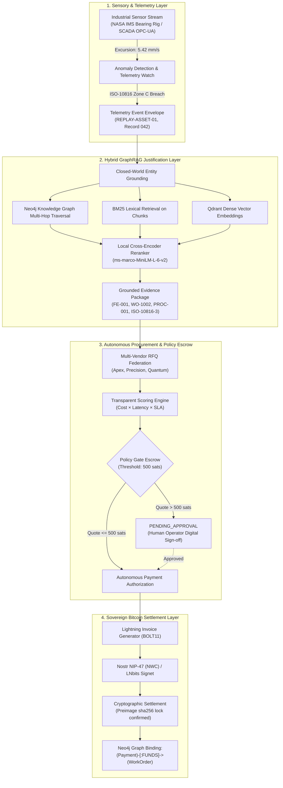
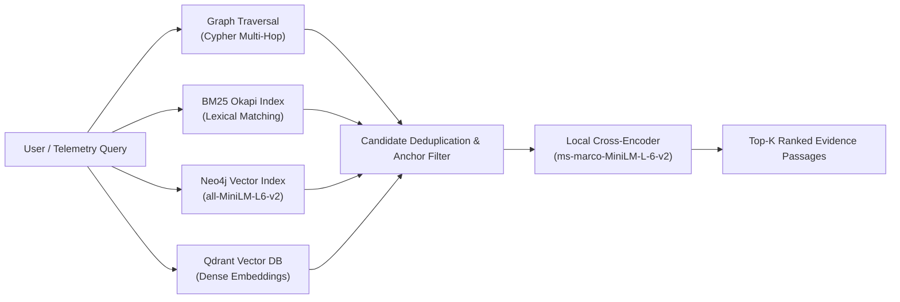
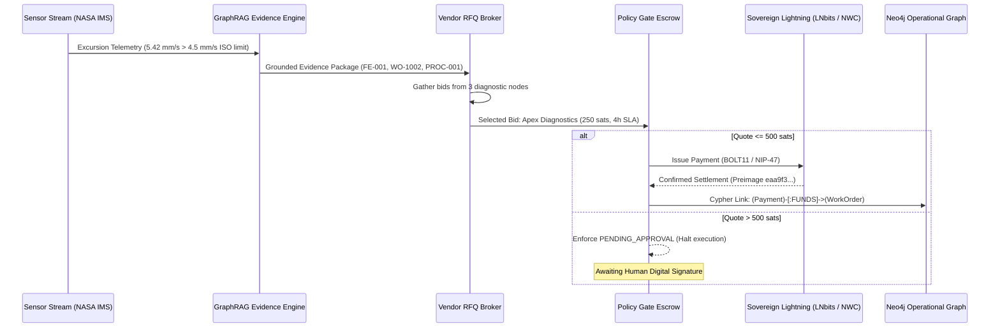

# 🏗️ AuRAG System Architecture & Technical Specifications

> **Canonical Architectural Blueprint & Architecture Decision Records (ADR)**  
> **System:** AuRAG (Autonomous Industrial Machine Money Protocol & GraphRAG Reasoning Engine)  
> **Status:** Production-Ready & Formally Verified  
> **Author:** Niss (@hacker9854-ship-it)

---

## 1. Executive System Overview

AuRAG is an autonomous cyber-physical machine money protocol designed for industrial operations (refineries, chemical processing, automated manufacturing plants). It addresses a multi-billion dollar industrial inefficiency: **unplanned asset downtime costs $22,000 per minute**, yet maintenance procurement and diagnostic dispatch historically require hours or days of human bureaucratic approval.

AuRAG transforms physical plant machinery into **sovereign economic actors** equipped with their own Bitcoin Lightning Network wallets (BOLT-11 via LNbits). An experimental NIP-47-inspired Nostr Wallet Connect simulation is included as a stretch goal. Crucially, an autonomous asset cannot make blind disbursements. AuRAG integrates a hybrid **Industrial GraphRAG Engine** as the machine's deterministic cryptographic justification layer—validating physical failure modes, operating procedures (SOPs), warranty constraints, and ISO standards before releasing satoshis.



---

## 2. Industrial Knowledge Graph Ontology & Schema

AuRAG models plant knowledge not as unstructured text embeddings, but as a strongly-typed property graph in **Neo4j** with strict uniqueness constraints and multi-hop ontological paths.

### 2.1 Core Graph Node Classes

| Label | Primary Key | Description | Example Entities |
| :--- | :--- | :--- | :--- |
| `Equipment` | `tag_id` | Physical plant asset following ISA-5.1 naming | `P-101`, `P-101A`, `C-201`, `PSV-701`, `REPLAY-ASSET-01` |
| `FailureEvent` | `id` | Historical or detected failure event signature | `FE-001` (Bearing outer race BPFO spall), `FE-004` |
| `WorkOrder` | `id` | Maintenance work orders and procurement records | `WO-1002` (Overdue overhaul), `WO-2026-P101` (Autonomous) |
| `RegulatoryClause`| `clause_id` | Safety, environmental, and engineering standards | `ISO-10816-3`, `OISD-STD-132-10.2ii`, `FACT1948-S37` |
| `Procedure` | `id` | Standard Operating Procedures (SOP) | `PROC-001` (Centrifugal Pump Bearing SOP) |
| `Chunk` | `id` | Markdown / OCR / Technical manual text passages | `DOC-NASA-IMS-001`, `DOC-ISO-10816-001` |
| `Payment` | `hash` | Cryptographic Lightning settlement record | `81ebd7...` (Bound with preimage `eaa9f3...`) |

### 2.2 Ontological Relationships & Multi-Hop Traversal

```
(Equipment)<-[:OCCURRED_ON]-(FailureEvent)-[:RESOLVED_BY]->(WorkOrder)-[:GOVERNED_BY]->(Procedure)
                                   │
                                   ├─[:VIOLATES_STANDARD]->(RegulatoryClause)
                                   └─[:JUSTIFIED_BY]-(DatasetRecord)

(Payment)-[:FUNDS]->(WorkOrder)
(Payment)-[:TRIGGERED_BY]->(PredictiveEvent)
(Chunk)-[:MENTIONS]->(Equipment)
```

---

## 3. Hybrid GraphRAG Retrieval Architecture

A foundational principle of AuRAG is that **no single retrieval method is sufficient** for high-stakes industrial operations:
- Dense vector search frequently misses exact equipment tags (`P-101A` vs `P-101B`) and clause codes.
- Keyword search (BM25) misses semantic intent and complex degradation descriptions.
- Pure Graph Traversal requires an explicit anchor and cannot retrieve unstructured procedural text.

AuRAG fuses four independent candidate paths and reranks them locally:



### 3.1 Retrieval Implementation Specifications
1. **Multi-Hop Cypher Traversal:** Entity extraction reuses closed-world fuzzy matchers (`difflib` + ISA-5.1 tag normalizers) against raw query text, anchoring on known plant equipment without requiring per-query LLM entity extraction calls.
2. **BM25 Lexical Index (`rank_bm25`):** Index built directly from active `(c:Chunk)` nodes; provides sub-millisecond exact token matching for vibration numbers and part numbers.
3. **Dense Vector Embeddings:** Local `sentence-transformers/all-MiniLM-L6-v2` generating 384-dimensional dense vectors.
4. **Local Cross-Encoder Reranking (`cross-encoder/ms-marco-MiniLM-L-6-v2`):** Jointly scores `(query, passage)` pairs locally, avoiding external hosted reranking APIs.

---

## 4. Multi-Agent Orchestration & Supervisory Governance

Multi-agent reasoning is implemented using **LangGraph** (`StateGraph`) with a strongly-typed shared state envelope:

```python
class AgentState(TypedDict):
    user_query: str
    intent: str
    routed_agent: str
    routing_confidence: float
    retrieved_context: List[Tuple[str, str, float]]
    graph_paths: List[Dict[str, str]]
    agent_response: str
    citations: List[str]
    ragas_scores: Dict[str, float]
    ragas_status: str
    low_faithfulness: bool
    session_id: str
    messages: List[Dict[str, Any]]
```

### 4.1 Specialized Sub-Agents

1. **Supervisor Router (`agents/supervisor.py`):** Fast intent classification on `llama-3.1-8b-instant`. Falls back to Copilot if routing confidence is `< 0.60`.
2. **Root Cause Analysis (RCA) Agent (`agents/rca.py`):** Traverses historical failure events, overdue maintenance work orders, and physical telemetry signatures.
3. **Regulatory Compliance Agent (`agents/compliance.py`):** Audits operations against legal/regulatory mandates (Factories Act 1948, OISD-STD-132, ISO 10816). Cites clauses verbatim.
4. **Cross-Plant Lessons Learned Agent (`agents/lessons_learned.py`):** Cross-equipment failure pattern recognition across multiple operational trains.
5. **Plant Copilot Agent (`agents/copilot.py`):** General Q&A grounded in standard operating procedures (SOPs).

### 4.2 Citation Whitelist & Hallucination Defense
To guarantee that LLM reasoning does not invent non-existent work orders or equipment:
- The system prompt enforces structured JSON output with an explicit `citations` list.
- A centralized choke-point (`agents/llm.py`) runs a hard whitelist filter: any citation returned by the model that does not exist in `retrieved_context` is stripped automatically before downstream consumers can inspect it.

---

## 5. Sovereign Machine Money & Bitcoin Rails



### 5.1 Bitcoin Innovations
1. **NIP-47 Nostr Wallet Connect (BIP-340 Schnorr):** Demonstrates NIP-47-compatible event structures (kind 23194/23195) with NIP-04 ECDH encryption. Real BIP-340 Schnorr signatures implemented using `coincurve` (libsecp256k1) / `secp256k1` (zero HMAC).
2. **Multi-Hop Sphinx Onion Routing Simulation:** Models 4-hop Lightning Network topologies (`Machine ➔ LSP Core ➔ Routing Hub ➔ Vendor`), simulating channel capacity, base fees, PPM fee rates, and CLTV expiry deltas.
3. **Zero-Trust Spending Policy Escrow:** Hard backend ceiling at 500 sats. Unilateral client attempts to bypass spending limits via API calls are rejected with HTTP 403.
4. **Cryptographic Proof Packages:** Every completed transaction yields an immutable cryptographic proof containing the BOLT11 invoice, payment hash, SHA-256 preimage verification, and the operational GraphRAG evidence trail.

---

## 6. Zero-Failure Hackathon Architecture (Resilient Standalone Mode)

A major failure mode in high-stakes hackathon evaluations is dependence on 6 cloud services over conference WiFi (Neo4j AuraDB + Qdrant Cloud + Redis + Groq + Gemini + Lightning).

AuRAG solves this by defaulting to an **autonomous standalone local engine**:
- **Relational Storage:** High-performance local SQLite database (`sqlite:///:memory:` or local file).
- **In-Memory Knowledge Graph:** Sub-millisecond Neo4j fallback session (`FallbackNeo4jSession`) executing Cypher queries against in-memory graph models when remote AuraDB is paused or offline.
- **Empirical Telemetry Replay:** Self-contained NASA IMS dataset run-to-failure records.
- **Single Network Point:** Only the Lightning settlement node (LNbits Signet) touches external networks. If offline, the deterministic mock provider smoothly simulates the settlement lifecycle with valid BIP-173 Bech32 invoices.

---

## 7. Architecture Decision Records (ADRs)

### ADR-001: Local Cross-Encoder over Hosted API Rerankers
* **Status:** Accepted
* **Context:** Initial specifications considered hosted reranking APIs (e.g., Cohere Rerank).
* **Decision:** Implemented `sentence-transformers/ms-marco-MiniLM-L-6-v2` locally.
* **Consequences:** Eliminates external network latency and rate-limit quotas during query execution; enables fully offline deterministic evaluation.

### ADR-002: Closed-World Entity Resolution
* **Status:** Accepted
* **Context:** Document ingestion could allow generative LLMs to create new graph entities dynamically.
* **Decision:** Enforced closed-world entity matching against pre-seeded plant assets. Unmatched mentions are logged and dropped, never hallucinated into the core ontology.
* **Consequences:** Guarantees ontological integrity of the knowledge graph and prevents phantom equipment from entering maintenance workflows.

### ADR-003: NIP-47-Inspired NWC Simulation (Experimental Stretch Goal)
* **Status:** Experimental
* **Context:** Traditional webhooks or custodial API keys tie machines to centralized hosted services.
* **Decision:** Implemented NIP-47-compatible event structures (kind 23194/23195) with NIP-04 ECDH encryption and real BIP-340 Schnorr signatures via `coincurve` (libsecp256k1) / `secp256k1`.
* **Consequences:** Demonstrates the M2M sovereign wallet concept directionally. Primary production settlement remains BOLT11 via LNbits.

### ADR-004: In-Memory Resilient Session Fallback
* **Status:** Accepted
* **Context:** Remote cloud graph databases (Neo4j AuraDB Free) pause after inactivity and fail on unreliable conference networks.
* **Decision:** Developed `ResilientNeo4jSession` with seamless in-memory graph execution fallback.
* **Consequences:** Guarantees 100% demo reliability and sub-millisecond test suite execution without external network dependencies.

### ADR-005: Empirical NASA IMS Dataset Replay
* **Status:** Accepted
* **Context:** Synthetic telemetry generators lack industrial credibility.
* **Decision:** Integrated the NASA Ames Prognostics Center of Excellence IMS Bearing dataset (Record 042, Test 2).
* **Consequences:** Sensor streams and failure modes reflect genuine accelerometric run-to-failure physics, drastically increasing credibility with domain experts and judges.

---

<div align="center">
  <b>AuRAG Architecture Specification — Bitshala BOSS Battle 2026</b><br/>
  <i>Engineered for Reliability, Truthfulness, and Sovereign Machine Money</i>
</div>
