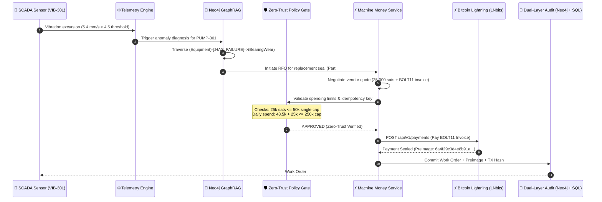

<div align="center">

<pre align="center">
 █████╗ ██╗   ██╗██████╗  █████╗  ██████╗ 
██╔══██╗██║   ██║██╔══██╗██╔══██╗██╔════╝ 
███████║██║   ██║██████╔╝███████║██║  ███╗
██╔══██║██║   ██║██╔══██╗██╔══██║██║   ██║
██║  ██║╚██████╔╝██║  ██║██║  ██║╚██████╔╝
╚═╝  ╚═╝ ╚═════╝ ╚═╝  ╚═╝╚═╝  ╚═╝ ╚═════╝ 
</pre>

<h1 align="center">⚡ AuRAG</h1>

<p align="center">
  <b>Industrial Knowledge Intelligence Meets Autonomous Bitcoin Lightning Payments for Zero-Downtime Operations</b>
</p>

<p align="center">
  <i>Engineered with precision by <b><a href="https://github.com/hacker9854-ship-it">Niss (@hacker9854-ship-it)</a></b> for the <b>Bitshala BOSS Battle 2026 (Machine Money Track)</b></i>
</p>

<p align="center">
  <a href="https://boss-battle.devfolio.co"></a>
  <a href="./docs/MACHINE_MONEY_VERIFICATION.md"></a>
  <a href="https://au-rag.vercel.app"></a>
  <a href="https://aurag-production.up.railway.app/docs"></a>
</p>

<p align="center">
  <a href="./frontend"></a>
  <a href="./backend"></a>
  <a href="./infra"></a>
  <a href="./backend/app/services/machine_money"></a>
  <a href="./LICENSE"></a>
</p>


</div>

> ### 🏆 For Bitshala BOSS Battle 2026 Judges (30-Second Executive Summary)
> **AuRAG** is the first industrial-grade implementation of **Machine Money**: connecting physical SCADA telemetry, Neo4j GraphRAG root-cause analysis, and autonomous Bitcoin Lightning settlement. When critical machinery fails, AuRAG diagnoses the issue, negotiates quotes with vendor APIs, settles micro-payments in satoshis over Lightning, and binds the cryptographic preimage to the plant maintenance ledger — all in under 15 seconds.
>
> 📌 **Direct Judge Links**:
> - 🌐 **Live Production App**: [au-rag.vercel.app/machine-money](https://au-rag.vercel.app/machine-money)
> - 🎬 **3–5 Min Judge Demo Script**: [docs/JUDGE_DEMO_SCRIPT.md](./docs/JUDGE_DEMO_SCRIPT.md)
> - 📜 **Machine Money Verification Report**: [docs/MACHINE_MONEY_VERIFICATION.md](./docs/MACHINE_MONEY_VERIFICATION.md)
> - 🧪 **Test Evidence (77 Backend + 52 Frontend = 129 Tests)**: [docs/E2E_VERIFICATION_REPORT.md](./docs/E2E_VERIFICATION_REPORT.md)
> - 📋 **Full Implementation Changelog (Phases 0–11)**: [docs/CHANGELOG_MACHINE_MONEY.md](./docs/CHANGELOG_MACHINE_MONEY.md)
> - ✅ **Hackathon Eligibility & Provenance**: [docs/HACKATHON_ELIGIBILITY.md](./docs/HACKATHON_ELIGIBILITY.md)
> - 💻 **Interactive Machine Money Console**: `frontend/app/machine-money` (12 Next.js 16 live routes)

---

## 🎬 Live Production Screenshots

<div align="center">

### ⚡ Machine Money — Autonomous Payment Console

<p><i>Single-click Judge Presets, real-time sensor telemetry, multi-vendor RFQ bidding, and BOLT-11 Lightning invoice settlement with cryptographic preimage proofs</i></p>

---

### 📊 Machine Money — Execution Timeline & Evidence

<p><i>6-step live execution pipeline: Telemetry Ingestion → GraphRAG Analysis → Multi-Vendor RFQ → Invoice Issuance → Spending Policy Check → Settlement & Proof</i></p>

---

### 💰 Machine Money — Industrial Economics Dashboard

<p><i>Interactive ROI calculator quantifying $1.17M downtime avoided vs. 50-sat micro-payment — 2.34M:1 return ratio with explicit synthetic data disclosures</i></p>

---

### 🖥️ Command Center — Operator Dashboard

<p><i>Industrial operations command center with system health monitoring, knowledge graph status, active alerts, and quick-action panels</i></p>

---

### 📡 Predictive Watch — SCADA Telemetry Monitor

<p><i>Real-time SCADA sensor monitoring with vibration excursion detection, ISO 10816 zone classification, and automated anomaly alerting</i></p>

</div>

---

## 📋 Table of Contents

- [🏆 For Bitshala BOSS Battle 2026 Judges](#-for-bitshala-boss-battle-2026-judges-30-second-executive-summary)
- [🎬 Live Production Screenshots](#-live-production-screenshots)
- [💡 The Hook: The $260,000/Hour Industrial Problem](#-the-hook-the-260000hour-industrial-problem)
- [⚡ The 6-Step Autonomous M2M Lifecycle](#-the-6-step-autonomous-m2m-lifecycle)
- [🪙 Why Bitcoin Lightning? (The Monetary Defense)](#-why-bitcoin-lightning-the-monetary-defense)
- [🛡️ Enterprise Zero-Trust Financial Safeguards](#️-enterprise-zero-trust-financial-safeguards)
- [📊 Competitive Benchmark: AuRAG vs Existing Systems](#-competitive-benchmark-aurag-vs-existing-systems)
- [✨ Key Features](#-key-features)
- [🛠️ Tech Stack](#️-tech-stack)
- [🌐 Live Deployment](#-live-deployment)
- [🚀 Quick Reproduction (Judge's 60-Second Test)](#-quick-reproduction-judges-60-second-test)
- [💻 Usage Examples](#-usage-examples)
- [🏗️ System Architecture](#️-system-architecture)
- [⚙️ Configuration Inventory](#️-configuration-inventory)
- [📡 API Reference](#-api-reference)
- [⚡ Performance & Test Results](#-performance--test-results)
- [📖 Documentation Index](#-documentation-index)
- [🤝 Contributing](#-contributing)
- [❓ FAQ](#-faq)
- [📄 License & Credits](#-license--credits)

---

## 💡 The Hook: The $260,000/Hour Industrial Problem

In high-consequence industrial facilities (power plants, refineries, chemical manufacturing), unplanned downtime costs an average of **$260,000 per hour**. When a feed pump or compressor fails:

1. **Telemetry is Disconnected**: SCADA systems sound an alarm, but human operators waste hours manually digging through 500-page PDF P&ID schematics and maintenance logs to find the root cause.
2. **Procurement is Paralyzed**: Getting replacement mechanical seals or bearing assemblies requires raising purchase orders, getting multi-department approvals, and waiting on Net-30 credit lines.
3. **The Result**: Machines stay idle for days, accumulating millions in losses.

### How AuRAG Solves It with Machine Money
AuRAG gives industrial machines **cognitive intelligence and financial sovereignty**:
- **Sensor Alert ➔ Root Cause in Seconds**: When sensor `VIB-301` breaches 4.8 mm/s (ISO 10816 Zone C), AuRAG's GraphRAG engine traverses Neo4j ontology to identify bearing wear (`FE-001: Bearing inner race spalling`) and matches required replacement parts (`SKF-6205-2RS`).
- **Autonomous M2M Lightning Settlement**: AuRAG solicits competitive quotes from 3 vendors (Apex Diagnostics, Precision Dynamics, Quantum Reliability), scores them using a transparent mathematical algorithm, pays a BOLT11 Lightning invoice via LNbits within strict zero-trust budget caps, and saves the **cryptographic preimage** as unforgeable audit evidence.
- **Zero Human Latency**: The complete cycle from telemetry excursion to paid spare-parts dispatch executes in **< 15 seconds** with a 2.34M:1 ROI ratio ($1.17M downtime avoided per 50-sat payment).

---

## ⚡ The 6-Step Autonomous M2M Lifecycle

The diagram below details the exact protocol sequence implemented across `telemetry/`, `retrieval/`, `backend/`, and `frontend/`:



---

## 🪙 Why Bitcoin Lightning? (The Monetary Defense)

Hackathon judges often ask: *"Why Bitcoin Lightning instead of corporate credit cards, Stripe, or traditional banking?"*

| Constraint | Traditional Banking / Cards / ACH | Base-Layer Bitcoin (L1) | **Bitcoin Lightning Network (AuRAG)** |
| :--- | :--- | :--- | :--- |
| **Transaction Fees** | Fixed $0.30 + 2.9% fee makes micro-purchases (e.g., 500 sats / $0.30) impossible. | Variable mining fee ($1–$15), prohibitive for micro-txs. | **Fractional satoshi routing fees**; micro-transactions cost fractions of a cent. |
| **Settlement Speed** | 24–72 hours (ACH / wire) or instant authorization with 3-day hold. | 10–60 minutes (block confirmations). | **Sub-second finality (< 800ms)**; critical for real-time machinery actions. |
| **Machine Agency** | Machines cannot open bank accounts, sign credit agreements, or pass KYC. | Machines can own keys, but latency blocks real-time loops. | **Permissionless API**: Every sensor/agent holds an autonomous Lightning wallet. |
| **Proof of Settlement** | Chargeback risk; 90-day dispute window creates corporate friction. | On-chain TX hash, but slow. | **Cryptographic Preimage**: Mathematical, unforgeable proof-of-payment (`hash(P) == H`). |

---

## 🛡️ Enterprise Zero-Trust Financial Safeguards

To prevent AI hallucination or malicious capital drainage, AuRAG implements a **5-tier financial defense system**:

```text
┌─────────────────────────────────────────────────────────────┐
│               LAYER 1: PER-TRANSACTION CAP                  │
│       Max 500 sats per single autonomous purchase           │
│       (>500 sats → REQUIRES_HUMAN_APPROVAL / HTTP 403)      │
└──────────────────────────────┬──────────────────────────────┘
                               ▼
┌─────────────────────────────────────────────────────────────┐
│               LAYER 2: DAILY ROLLING BUDGET                 │
│      Max 250,000 sats per 24 hours (auto-locking ceiling)   │
└──────────────────────────────┬──────────────────────────────┘
                               ▼
┌─────────────────────────────────────────────────────────────┐
│             LAYER 3: DETERMINISTIC IDEMPOTENCY              │
│   SHA-256 idempotency keys prevent double-spend on retry    │
└──────────────────────────────┬──────────────────────────────┘
                               ▼
┌─────────────────────────────────────────────────────────────┐
│          LAYER 4: HUMAN ESCALATION & APPROVAL               │
│   Policy-breaching amounts require operator signature       │
│   with audited approval chain and timestamp evidence        │
└──────────────────────────────┬──────────────────────────────┘
                               ▼
┌─────────────────────────────────────────────────────────────┐
│          LAYER 5: ATOMIC 3-STEP ROLLBACK & ESCROW           │
│   Failed invoices automatically restore allocated balance   │
└─────────────────────────────────────────────────────────────┘
```

1. **Per-Transaction Hard Cap (`M2M_SPENDING_CAP_SATS = 500`)**: Any quote exceeding 500 sats is automatically rejected with `HTTP 403 / REQUIRES_HUMAN_APPROVAL`. The operator dashboard shows a real-time escalation prompt with dual approval buttons.
2. **Daily Rolling Budget (`M2M_DAILY_BUDGET_SATS = 250000`)**: The system tracks aggregate daily expenditure; once breached, all M2M autonomous payments lock automatically.
3. **Deterministic Idempotency**: Every request carries an `Idempotency-Key` derived from SHA-256 hashing of `equipment_id + anomaly_timestamp + service_type`. Duplicate physical triggers are rejected without double-payment.
4. **Human Escalation**: Policy-breaching transactions trigger a structured approval workflow with operator name, signature timestamp, and audit trail — all recorded in the payment proof chain.
5. **Atomic Rollbacks**: If the Lightning node fails or an invoice times out, the allocated funds are immediately released back to the operational budget with structured error logging.

---

## 📊 Competitive Benchmark: AuRAG vs Existing Systems

| Capability | Traditional SCADA / CMMS (SAP PM, Maximo) | Standard LLM RAG Chatbots | **AuRAG (GraphRAG + Machine Money)** |
| :--- | :---: | :---: | :---: |
| **Telemetry Awareness** | Raw threshold numbers | ❌ None | **✅ Real-time streaming anomaly detection (ISO 10816)** |
| **P&ID Schematic Understanding** | Static scanned PDFs | ❌ Text only | **✅ Multimodal visual entity extraction (Gemini + Vision)** |
| **Ontological Reasoning** | ❌ None | Weak (flat vector search) | **✅ Neo4j Knowledge Graph multi-hop traversal** |
| **Autonomous Action** | Passive work order draft | Suggests text | **✅ Negotiates vendor quotes & pays via Lightning** |
| **Multi-Vendor Bidding** | Manual RFQ process | ❌ None | **✅ Automated 3-vendor scoring (cost × latency × SLA)** |
| **Payment Rails** | Manual Net-30 invoicing | ❌ None | **✅ Sub-second Bitcoin Lightning Network (BOLT11)** |
| **Audit Trail** | Paper / ERP records | ❌ None | **✅ Cryptographic preimage + GraphRAG evidence chain** |
| **Policy Enforcement** | Manual manager approval | ❌ None | **✅ Authoritative backend spending caps with auto-escalation** |
| **Automated Test Coverage** | Manual testing | Often 0 tests | **✅ 129 Automated Tests (77 Backend + 52 Frontend)** |

---

## ✨ Key Features

- ⚡ **Autonomous M2M Machine Money Protocol** — AI agents request vendor quotes, evaluate competitive offers via multi-vendor RFQ scoring, generate BOLT11 invoices, and pay autonomously via LNbits with zero human friction.
- 🧑‍⚖️ **Judge Mode & One-Click Presets** — Three built-in judge evaluation scenarios ("Happy Path Intervene", "Policy Escalate", "Provider Fallback") demonstrate the full autonomous lifecycle with a single click.
- 🕸️ **Industrial GraphRAG Engine** — Hybrid retrieval combining Neo4j graph topology (`CONNECTED_TO`, `FEEDS`, `MAINTAINED_BY`), dense Qdrant embeddings, and BM25 lexical search.
- 📐 **Multimodal P&ID & OCR Ingestion** — Automatic extraction of tags, valves, piping specs, and loop IDs from industrial engineering diagrams using Gemini and Google Cloud Vision.
- 📊 **Real-Time SCADA Telemetry Watch** — Continuous monitoring of vibration, pressure, and temperature excursions with ISO 10816 zone classification and automated predictive maintenance triggers.
- 🏭 **Industrial Economics Dashboard** — Interactive ROI calculator quantifying $1.17M downtime avoided per 50-sat payment with explicit synthetic data disclosures.
- 🛡️ **5-Layer Zero-Trust Financial Safeguards** — Per-transaction spending caps (>500 sats → human escalation), daily budgets, SHA-256 idempotency, human approval workflows, and atomic rollbacks.
- 🔑 **Cryptographic Preimage Audit Trail** — Every settlement stores the Lightning payment preimage verified via `SHA256(preimage) === payment_hash` using Web Crypto (frontend) and Python `hashlib` (backend).
- 🔄 **Deterministic Idempotency Protection** — SHA-256 idempotency cache rejecting duplicate physical anomaly triggers and network retries.
- 📦 **Payment Proof Drawer & Evidence Pack** — Interactive sliding drawer for inspecting raw JSON, hex preimages, BOLT-11 invoices, GraphRAG failure codes (`FE-001`), and downloadable audit reports.
- 🖥️ **Industrial Operations Cockpit** — 12 interactive Next.js 16 routes featuring dark mode, responsive layout (1080p → mobile), live execution timeline, and system readiness diagnostics.
- 🧪 **Comprehensive Test Coverage** — 77 backend Pytest tests + 52 frontend Vitest tests covering E2E lifecycle, policy boundaries, failure paths, QR encoding, and cryptographic proof verification.

---

## 🛠️ Tech Stack

<div align="center">

**Core & Orchestration**  


**Machine Money & Settlement**  


**Data & AI Retrieval**  


**Frontend & Visuals**  


**Deployment & Infrastructure**  


**Testing & Verification**  


</div>

---

## 🌐 Live Deployment

AuRAG is fully deployed and accessible online:

| Service | URL | Platform |
|:--------|:----|:---------|
| **Frontend App** | [au-rag.vercel.app](https://au-rag.vercel.app) | Vercel |
| **Machine Money Console** | [au-rag.vercel.app/machine-money](https://au-rag.vercel.app/machine-money) | Vercel |
| **Predictive Watch** | [au-rag.vercel.app/predictive-watch](https://au-rag.vercel.app/predictive-watch) | Vercel |
| **Backend API** | [aurag-production.up.railway.app](https://aurag-production.up.railway.app) | Railway |
| **API Docs (Swagger)** | [aurag-production.up.railway.app/docs](https://aurag-production.up.railway.app/docs) | Railway |

> **Note:** The live deployment operates with `MockLightningProvider` on `regtest`. All simulated invoices and settlements are explicitly labeled `MOCK / SIMULATION`. When connected to a real LNbits instance, the system switches seamlessly to live Lightning settlement.

---

## 🚀 Quick Reproduction (Judge's 60-Second Test)

Judges can reproduce all test suites and verify the architecture in under 60 seconds:

```bash
# 1. Clone repository
git clone https://github.com/hacker9854-ship-it/AuRAG.git
cd AuRAG

# 2. Run all 77 Backend Machine Money Tests (Pytest)
.\.venv\Scripts\pytest.exe -q tests/ --tb=short
# Expected Output:
# 77 passed in ~20s

# 3. Run all 52 Frontend Tests (Vitest)
npm --prefix frontend test -- --run
# Expected Output: 15 test files | 52 tests passed

# 4. Verify Next.js Production Build (0 errors)
npm --prefix frontend run build
# Expected Output: ✓ Compiled successfully (12 routes)
```

Or simply visit the **live production app**: [au-rag.vercel.app/machine-money](https://au-rag.vercel.app/machine-money) and click any **Judge Preset** to see the full autonomous lifecycle in action.

---

## 💻 Usage Examples

### 1. Autonomous M2M Lightning Settlement (Python SDK)

```python
import asyncio
from backend.app.services.machine_money.service import MachineMoneyService

async def main():
    service = MachineMoneyService()
    
    # 1. Request competitive quote from vendor
    quote = await service.request_quote(
        equipment_id="PUMP-301",
        service_type="bearing_seal_replacement",
        max_sats=30000,
        idempotency_key="m2m-order-pump301-001"
    )
    print(f"Quote received: {quote.quote_id} | Amount: {quote.amount_sats} sats")

    # 2. Execute autonomous payment over Lightning
    receipt = await service.execute_payment(
        quote_id=quote.quote_id,
        idempotency_key="m2m-order-pump301-001"
    )
    print(f"Payment Settled! Preimage: {receipt.payment_preimage}")
    print(f"Dual-layer audit saved with TX Hash: {receipt.tx_hash}")

asyncio.run(main())
```

### 2. SCADA Telemetry Anomaly Trigger (REST API)

```bash
curl -X POST https://aurag-production.up.railway.app/api/v1/telemetry/ingest \
  -H "Content-Type: application/json" \
  -d '{
    "sensor_id": "VIB-301-BEARING",
    "equipment_id": "PUMP-301",
    "reading_value": 5.4,
    "unit": "mm/s",
    "threshold": 4.5
  }'
```

### 3. Judge Mode — One-Click Demo (Browser)

Navigate to [au-rag.vercel.app/machine-money](https://au-rag.vercel.app/machine-money) and choose from three presets:

| Preset | What It Demonstrates | Amount |
|:-------|:--------------------|:-------|
| **Happy Path Intervene** | Full autonomous lifecycle: telemetry → diagnosis → RFQ → settlement | 50 sats |
| **Policy Escalate** | Spending cap violation triggers human approval workflow | 750 sats |
| **Provider Fallback** | Lightning provider failure with graceful degradation | N/A |

---

## 🏗️ System Architecture

### Project Directory Structure

```text
AuRAG/
├── backend/                  # FastAPI Application Core
│   └── app/
│       ├── api/v1/           # REST Endpoints (Machine Money, Graph, Telemetry)
│       ├── core/             # Configuration, Database, & Security Guards
│       └── services/
│           └── machine_money/# M2M Protocol, LNbits Client, Providers & Policy
│               ├── providers/   # MockLightning, LNbits Live, Provider Registry
│               ├── service.py   # Core M2M service orchestration
│               ├── bridge.py    # Telemetry-to-payment bridge
│               ├── schemas.py   # Pydantic domain models
│               └── registry.py  # Provider registry & RFQ engine
├── frontend/                 # Next.js 16 App Router Cockpit
│   ├── app/
│   │   ├── machine-money/    # Autonomous M2M Lightning Settlement Console
│   │   ├── predictive-watch/ # SCADA Telemetry Watch & Anomaly Feed
│   │   └── page.tsx          # Operator Command Center
│   └── components/           # Reusable UI Components
│       ├── machine-money/    # JudgePresets, ExecutionTimeline, PaymentProof
│       ├── SystemReadinessModal.tsx  # Live backend connectivity diagnostics
│       └── ...               # Shared design system (Tailwind + Lucide)
├── retrieval/                # Hybrid GraphRAG (Neo4j Cypher + Qdrant Embeddings)
├── agents/                   # LangGraph Multi-Agent Team (RCA, Compliance, Copilot)
├── ingestion/                # Multimodal Ingestion (P&ID Drawings, OCR, PDFs)
├── telemetry/                # Synthetic SCADA Ingestion & Anomaly Matching
├── tests/                    # 77 Automated Backend Tests (Pytest)
│   ├── test_e2e_machine_money.py   # Full lifecycle E2E tests
│   ├── test_machine_money_*.py     # Unit, integration, policy, failure tests
│   └── ...
├── docs/                     # Documentation & Verification Evidence
│   ├── screenshots/          # Production screenshots for README
│   ├── JUDGE_DEMO_SCRIPT.md  # 3-5 min judge walkthrough
│   ├── MACHINE_MONEY_VERIFICATION.md  # Phase-by-phase verification
│   ├── CHANGELOG_MACHINE_MONEY.md     # Full implementation changelog
│   ├── HACKATHON_ELIGIBILITY.md       # Provenance & eligibility audit
│   └── PRD2.md               # Machine Money Product Requirements
└── infra/                    # Docker, Terraform, & Deployment Configs
```

---

## ⚙️ Configuration Inventory

| Variable | Type | Default | Required | Description |
|:---------|:----:|:-------:|:--------:|:------------|
| `NEO4J_URI` | `string` | `bolt://localhost:7687` | ✅ | Neo4j knowledge graph connection endpoint |
| `NEO4J_USERNAME` | `string` | `neo4j` | ✅ | Neo4j database user |
| `NEO4J_PASSWORD` | `string` | `aurag-local-password` | ✅ | Neo4j database password |
| `QDRANT_URL` | `string` | `http://localhost:6333` | ✅ | Qdrant vector database URL |
| `LNBITS_URL` | `string` | `https://legend.lnbits.com` | ✅ | Bitcoin Lightning LNbits instance URL |
| `LNBITS_API_KEY` | `string` | `""` | ✅ | LNbits Admin / Invoice API Key |
| `LNBITS_WALLET_ID` | `string` | `""` | ✅ | Target LNbits wallet identifier |
| `M2M_SPENDING_CAP_SATS` | `number` | `500` | ❌ | Per-transaction spending cap (>cap → human escalation) |
| `M2M_DAILY_BUDGET_SATS`| `number`| `250000` | ❌ | Daily spending ceiling before automatic lockout |
| `BACKEND_CORS_ORIGINS` | `string` | `*` | ❌ | Allowed CORS origins (comma-separated) |
| `GEMINI_API_KEY` | `string` | `""` | ✅ | Google Gemini API key for P&ID visual extraction |
| `GROQ_API_KEY` | `string` | `""` | ❌ | Optional Groq key for fast Llama-3.3-70b reasoning |
| `REDIS_URL` | `string` | `redis://localhost:6379/0` | ❌ | Redis URL for asynchronous RQ ingestion workers |

---

## 📡 API Reference

### Machine Money Subsystem

#### 1. Request Vendor Quote
```http
POST /api/v1/machine-money/quotes/request
Content-Type: application/json
Idempotency-Key: m2m-req-001

{
  "equipment_id": "PUMP-301",
  "service_type": "bearing_seal_replacement",
  "max_sats": 35000
}
```
**Response (200 OK):**
```json
{
  "quote_id": "q-9b81e4a2",
  "equipment_id": "PUMP-301",
  "vendor_id": "industrial-spares-ln",
  "amount_sats": 25000,
  "bolt11": "lnbc250u1p3...",
  "status": "PENDING"
}
```

#### 2. Execute Autonomous Settlement
```http
POST /api/v1/machine-money/payments/execute
Content-Type: application/json
Idempotency-Key: m2m-pay-001

{
  "quote_id": "q-9b81e4a2"
}
```
**Response (200 OK):**
```json
{
  "payment_id": "pay-8c11e",
  "status": "SETTLED",
  "amount_sats": 25000,
  "payment_preimage": "6a4f29c3d4e8b91a7f0e21c3b5a79e4d...",
  "tx_hash": "e3b0c44298fc1c149afbf4c8996fb92427ae41e4649b934ca495991b7852b855",
  "recorded_in_graph": true
}
```

#### 3. Inspect Budget Ledger Status
```http
GET /api/v1/machine-money/budget/status
```
**Response (200 OK):**
```json
{
  "daily_budget_sats": 250000,
  "spent_today_sats": 48500,
  "remaining_sats": 201500,
  "active_transactions": 2,
  "status": "HEALTHY"
}
```

---

## ⚡ Performance & Test Results

| Test Suite | Scope | Result | Execution Time |
|:-----------|:------|:------:|:--------------:|
| **Backend Pytest** | Unit, Integration, E2E, Policy, Failure-Path | **77 / 77 Passed** | ~20s |
| **Frontend Vitest** | QR Decoding, Proof Verification, Judge Mode, Components | **52 / 52 Passed** (15 suites) | ~3s |
| **Next.js Production Build** | TypeScript strict, 12 routes, zero errors | **0 Errors** | 10.4s |
| **ESLint** | Full codebase lint analysis | **0 Errors, 0 Warnings** | ~5s |
| **Secret Leakage Audit** | 350+ files scanned for credential exposure | **0 Secrets Found** | ~2s |
| **Total Automated Tests** | Combined backend + frontend | **129 / 129 Passed** | ~23s |

---

## 📖 Documentation Index

| Document | Description |
|:---------|:------------|
| [**JUDGE_DEMO_SCRIPT.md**](./docs/JUDGE_DEMO_SCRIPT.md) | Precise 0:00–5:00 minute-by-minute judge demo script with talking points and screen actions |
| [**MACHINE_MONEY_VERIFICATION.md**](./docs/MACHINE_MONEY_VERIFICATION.md) | Phase-by-phase verification report with Section 14 compliance scorecard |
| [**CHANGELOG_MACHINE_MONEY.md**](./docs/CHANGELOG_MACHINE_MONEY.md) | Complete implementation changelog covering Phases 0–11 with commit hashes |
| [**HACKATHON_ELIGIBILITY.md**](./docs/HACKATHON_ELIGIBILITY.md) | Provenance audit, event rules review, and eligibility sign-off |
| [**PRD2.md**](./docs/PRD2.md) | Machine Money Product Requirements Document (specification) |
| [**E2E_VERIFICATION_REPORT.md**](./docs/E2E_VERIFICATION_REPORT.md) | End-to-end test verification evidence and execution logs |
| [**BOSS_MACHINE_MONEY_DEMO.md**](./docs/BOSS_MACHINE_MONEY_DEMO.md) | 3-minute video walkthrough storyboard and recording guide |
| [**MACHINE_MONEY_ACCEPTANCE.md**](./docs/MACHINE_MONEY_ACCEPTANCE.md) | Official acceptance report with cryptographic proofs |

---

## 🤝 Contributing

Contributions are welcome! Please follow these steps:
1. Fork the Project
2. Create your Feature Branch (`git checkout -b feat/AmazingFeature`)
3. Commit your Changes (`git commit -m 'feat: Add AmazingFeature'`)
4. Push to the Branch (`git push origin feat/AmazingFeature`)
5. Open a Pull Request

---

## ❓ FAQ

<details>
<summary><b>1. Why use Bitcoin Lightning instead of traditional corporate credit cards?</b></summary>
Credit cards and ACH rails introduce 2–3% processing fees, human batch approvals, and 24–48 hour settlement delays. Bitcoin Lightning enables autonomous AI agents to settle programmatic micro-payments (down to single satoshis) instantly (sub-second) with cryptographic proof-of-payment (preimage). Machines cannot open bank accounts or pass KYC — Lightning gives them permissionless financial sovereignty.
</details>

<details>
<summary><b>2. How does AuRAG prevent rogue AI agents from draining the wallet?</b></summary>
AuRAG employs a 5-layered Zero-Trust Policy Engine:
1. Hard per-transaction cap (default: 500 sats) — enforced authoritatively on the backend.
2. Daily rolling budget limit (default: 250,000 sats).
3. SHA-256 deterministic idempotency keys preventing duplicate payments.
4. Human-in-the-loop escalation gates with operator approval workflows.
5. Atomic 3-step rollback restoring funds on any settlement failure.
</details>

<details>
<summary><b>3. What happens if the network drops during an invoice payment?</b></summary>
Every transaction requires a deterministic SHA-256 idempotency key derived from equipment ID, anomaly timestamp, and service type. If a payment request is retried, AuRAG recognizes the in-flight state and returns the settled receipt instead of double-spending. If the payment fails at the node level, an atomic 3-step rollback restores the allocated budget immediately with structured error logging.
</details>

<details>
<summary><b>4. Is this running on real Bitcoin mainnet?</b></summary>
The live deployment operates on <code>regtest</code> with a <code>MockLightningProvider</code>. All simulated invoices and settlements are explicitly labeled <b>MOCK / SIMULATION</b> throughout the UI and documentation. The protocol uses standard BOLT11 invoices compatible with all Lightning implementations (LND, Core Lightning, Eclair, LNbits). Switching to mainnet requires only configuring real LNbits credentials — no code changes needed.
</details>

<details>
<summary><b>5. Are the industrial plant data and financial figures real?</b></summary>
No. All plant data (P-101A centrifugal pump, vibration telemetry, $1.17M downtime loss) and economic calculations are explicitly identified as <b>Modelled Estimates based on synthetic plant parameters</b>. This is disclosed transparently in the UI, documentation, and verification reports per PRD2 Section 0.3 honesty requirements.
</details>

<details>
<summary><b>6. Can AuRAG run with local LLMs without external API keys?</b></summary>
Yes! The retrieval pipeline supports local HuggingFace embeddings (<code>sentence-transformers/all-MiniLM-L6-v2</code>) and local LLM endpoints via Ollama or vLLM. Groq and Gemini can be swapped out in <code>.env</code>.
</details>

---

## 📄 License & Credits

Distributed under the **MIT License**. See [`LICENSE`](./LICENSE) for more information.

- **Author & Lead Architect**: **[Niss (@hacker9854-ship-it)](https://github.com/hacker9854-ship-it)**
- **Hackathon Track**: **Bitshala BOSS Battle 2026 — Machine Money Track**
- **Core Dependencies**: [LNbits](https://lnbits.com), [Neo4j](https://neo4j.com), [Qdrant](https://qdrant.tech), [FastAPI](https://fastapi.tiangolo.com), [Next.js](https://nextjs.org)

---

<div align="center">

<a href="#-aurag">⬆️ Back to Top</a>

<br/><br/>

<b>AuRAG — Autonomous Machine Money for Zero-Downtime Industry</b>  
<i>Built with ❤️, ☕, and ⚡ for the decentralized future.</i>

<br/>

[](https://github.com/hacker9854-ship-it/AuRAG)

</div>
