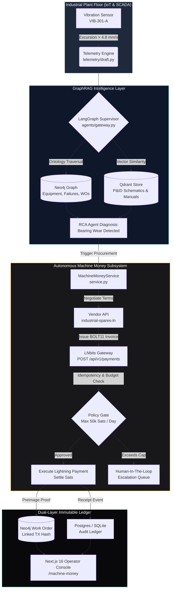

<div align="center">

```text
 █████╗ ██╗   ██╗██████╗  █████╗  ██████╗ 
██╔══██╗██║   ██║██╔══██╗██╔══██╗██╔════╝ 
███████║██║   ██║██████╔╝███████║██║  ███╗
██╔══██║██║   ██║██╔══██╗██╔══██║██║   ██║
██║  ██║╚██████╔╝██║  ██║██║  ██║╚██████╔╝
╚═╝  ╚═╝ ╚═════╝ ╚═╝  ╚═╝╚═╝  ╚═╝ ╚═════╝ 
```

# ⚡ AuRAG

> **Industrial knowledge intelligence meets autonomous Bitcoin Lightning payments for zero-downtime operations.**

[](https://boss-battle.devfolio.co)
[](./docs/E2E_VERIFICATION_REPORT.md)
[](./frontend)
[](./backend)
[](./infra)
[](./backend/app/services/machine_money)
[](./LICENSE)
[](https://github.com/hacker9854-ship-it)


</div>

## 💡 The Hook

Industrial facilities bleed over **$260,000 per hour** in unplanned downtime because SCADA alerts, engineering P&ID drawings, and spare parts procurement operate in disjointed silos. When a critical feed pump vibrates out of spec, human technicians waste hours cross-referencing maintenance binders, requesting vendor quotes, and waiting for manual finance purchase orders.

**AuRAG closes this loop end-to-end.** It unifies industrial sensor telemetry, P&ID visual extraction, and Neo4j GraphRAG reasoning with an autonomous **Bitcoin Lightning Machine Money protocol**. The moment an anomaly breaches safety thresholds, AuRAG diagnoses the root cause, requests and validates cryptographic vendor quotes, settles micro-payments in satoshis over the Lightning Network, and records verifiable payment preimages directly into the plant's knowledge graph—executing in seconds what used to take days.

---

## 🎬 Demo

<div align="center">

| ⚡ Machine Money Autonomous Cockpit | 🔍 Grounded GraphRAG Investigation |
|:-----------------------------------:|:----------------------------------:|
|  |  |
| *Real-time satoshi budgets, vendor quotes, & Lightning settlements* | *Multi-hop causal reasoning across equipment, P&ID tags, & work orders* |

> 📹 **Watch the Complete 3-Minute Video Walkthrough**: [Video Script & Screen Recording Guide](./docs/BOSS_MACHINE_MONEY_DEMO.md)  
> 📜 **Official Acceptance & Cryptographic Proofs**: [Machine Money Acceptance Report](./docs/MACHINE_MONEY_ACCEPTANCE.md)

</div>

---

## 📋 Table of Contents

- [✨ Features](#-features)
- [🛠️ Tech Stack](#️-tech-stack)
- [🚀 Getting Started](#-getting-started)
  - [Prerequisites](#prerequisites)
  - [Installation](#installation)
  - [Quick Start](#-quick-start-tldr)
- [💻 Usage](#-usage)
  - [1. Autonomous M2M Lightning Settlement](#1-autonomous-m2m-lightning-settlement)
  - [2. SCADA Telemetry Anomaly Trigger](#2-scada-telemetry-anomaly-trigger)
  - [3. Multi-Hop GraphRAG Root Cause Analysis](#3-multi-hop-graphrag-root-cause-analysis)
- [🏗️ Architecture](#️-architecture)
  - [Data & Settlement Flow](#data--settlement-flow)
  - [Project Directory Structure](#project-directory-structure)
- [⚙️ Configuration](#️-configuration)
- [📡 API Reference](#-api-reference)
- [⚡ Performance & Verification](#-performance--verification)
- [🤝 Contributing](#-contributing)
- [❓ FAQ](#-faq)
- [📄 License](#-license)
- [🙏 Acknowledgements](#-acknowledgements)

---

## ✨ Features

- ⚡ **Autonomous M2M Machine Money Protocol** — AI agents request vendor quotes, evaluate competitive offers, generate BOLT11 invoices, and pay autonomously via LNbits with zero human friction.
- 🕸️ **Industrial GraphRAG Engine** — Hybrid retrieval combining Neo4j graph topology (`CONNECTED_TO`, `FEEDS`, `MAINTAINED_BY`), dense Qdrant embeddings, and BM25 lexical search.
- 📐 **Multimodal P&ID & OCR Ingestion** — Automatic extraction of tags, valves, piping specs, and loop IDs from industrial engineering diagrams using Gemini and Google Cloud Vision.
- 📊 **Real-Time SCADA Telemetry Watch** — Continuous monitoring of vibration, pressure, and temperature excursions with automated predictive maintenance event generation.
- 🛡️ **Zero-Trust Financial Safeguards** — Strict per-transaction satoshi limits, daily spending ceilings, and atomic 3-step rollbacks prevent unauthorized capital drain.
- 🔑 **Cryptographic Preimage Audit Trail** — Every settlement stores the Lightning payment preimage, invoice hash, and equipment ID permanently linked in the Neo4j audit ledger.
- 🔄 **Strict Idempotency Protection** — Deterministic SHA-256 idempotency keys prevent duplicate payments and replay attacks under intermittent network conditions.
- 🖥️ **Industrial Operations Cockpit** — 18 interactive Next.js 16 routes featuring dark mode, live budget gauges, real-time quote comparison, and knowledge-risk matrix.

<details>
<summary>🗺️ Roadmap — Coming Soon</summary>

- [ ] Cashu / Chaumian e-cash ecash token support for disconnected, offline industrial sensors.
- [ ] Multi-sig Lightning federation Escrows for high-value capital asset purchases (> 1,000,000 sats).
- [ ] Hardware Security Module (HSM) signing key isolation for plant-floor edge microcontrollers.
- [ ] OpenTelemetry / Prometheus exporter for satoshi burn rates and telemetry correlation metrics.

</details>

---

## 🛠️ Tech Stack

<div align="center">

**Core & Orchestration**  


**Machine Money & Settlement**  


**Data & AI Retrieval**  


**Frontend & Visuals**  


**Testing & Verification**  


</div>

---

## 🚀 Getting Started

### Prerequisites

Ensure you have the following installed locally:
- **Python**: `>= 3.12`
- **Node.js**: `>= 20.0.0`
- **Docker**: Optional (for local Neo4j & Qdrant containers) or active cloud endpoints.
- **LNbits Instance**: Demo instance at `https://legend.lnbits.com` or self-hosted server.

```bash
# Verify your environment
python --version   # Expected: Python 3.12.x
node -v           # Expected: v20.x.x or higher
```

### Installation

```bash
# 1. Clone the repository
git clone https://github.com/hacker9854-ship-it/AuRAG.git
cd AuRAG

# 2. Set up Python virtual environment
python -m venv .venv

# On Linux/macOS:
source .venv/bin/activate
# On Windows:
.\.venv\Scripts\activate

# 3. Install backend dependencies
pip install -r requirements.txt

# 4. Install frontend dependencies
npm --prefix frontend install

# 5. Configure environment variables
cp .env.example .env
# Edit .env with your LNbits, Neo4j, and Gemini credentials
```

<details>
<summary>🪟 Windows-specific bootstrap steps</summary>

A one-click PowerShell script is included to bootstrap Python venv, dependencies, and seed data:

```powershell
powershell.exe -NoProfile -ExecutionPolicy Bypass -File .\scripts\bootstrap.ps1
```

</details>

### ⚡ Quick Start (TL;DR)

Start both backend and frontend concurrently in two terminals:

```bash
# Terminal 1 — Start FastAPI Server (Port 8000)
.\.venv\Scripts\python.exe -m uvicorn backend.app.main:app --host 127.0.0.1 --port 8000 --reload

# Terminal 2 — Start Next.js Operations Console (Port 3000)
npm --prefix frontend run dev
```

Open [http://localhost:3000](http://localhost:3000) in your browser to view the Command Center!

---

## 💻 Usage

### 1. Autonomous M2M Lightning Settlement

Programmatically negotiate a quote and settle an invoice for industrial pump seals:

```python
import asyncio
from backend.app.services.machine_money.service import MachineMoneyService

async def main():
    service = MachineMoneyService()
    
    # 1. Request competitive quote from vendor
    quote = await service.request_quote(
        equipment_id="PUMP-301",
        service_type="vibration_bearing_seal",
        max_sats=30000,
        idempotency_key="m2m-order-pump301-001"
    )
    print(f"Quote received: {quote.quote_id} | Amount: {quote.amount_sats} sats")

    # 2. Execute autonomous payment over Lightning
    receipt = await service.execute_payment(
        quote_id=quote.quote_id,
        idempotency_key="m2m-order-pump301-001"
    )
    print(f"Payment Settled! Preimage: {receipt.payment_preimage}")
    print(f"Dual-layer audit saved with TX Hash: {receipt.tx_hash}")

asyncio.run(main())
```

### 2. SCADA Telemetry Anomaly Trigger

Simulate a vibration excursion on `PUMP-301` that triggers automatic diagnosis and procurement:

```bash
curl -X POST http://127.0.0.1:8000/api/v1/telemetry/ingest \
  -H "Content-Type: application/json" \
  -d '{
    "sensor_id": "VIB-301-BEARING",
    "equipment_id": "PUMP-301",
    "reading_value": 5.4,
    "unit": "mm/s",
    "threshold": 4.5
  }'
```

### 3. Multi-Hop GraphRAG Root Cause Analysis

Ask the supervisor agent to inspect plant evidence and suggest repair work orders:

```bash
curl -X POST http://127.0.0.1:8000/api/v1/chat \
  -H "Content-Type: application/json" \
  -d '{
    "question": "What caused the high vibration alert on PUMP-301 and what work orders match?",
    "session_id": "operator-shift-a"
  }'
```

<details>
<summary>📚 Advanced Usage: Dynamic Budget Adjustments</summary>

Enforce dynamic daily satoshi caps via API:

```bash
curl -X POST http://127.0.0.1:8000/api/v1/machine-money/budget/configure \
  -H "Content-Type: application/json" \
  -H "X-Admin-Key: your-admin-secret" \
  -d '{
    "daily_budget_sats": 250000,
    "max_single_tx_sats": 50000,
    "require_human_above_sats": 40000
  }'
```

</details>

---

## 🏗️ Architecture

### Data & Settlement Flow



### Project Directory Structure

```text
AuRAG/
├── backend/                  # FastAPI Application Core
│   └── app/
│       ├── api/v1/           # REST Endpoints (Machine Money, Graph, Telemetry)
│       ├── core/             # Configuration, Database, & Security Guards
│       └── services/
│           └── machine_money/# M2M Protocol, LNbits Client, & Idempotency
├── frontend/                 # Next.js 16 App Router Cockpit
│   ├── app/
│   │   ├── machine-money/    # Real-Time M2M Lightning Settlement Workspace
│   │   ├── predictive-watch/ # SCADA Telemetry Watch & Anomaly Feed
│   │   └── page.tsx          # Operator Command Center
│   └── components/           # Reusable UI Design System (Tailwind + Lucide)
├── retrieval/                # Hybrid GraphRAG (Neo4j Cypher + Qdrant Embeddings)
├── agents/                   # LangGraph Multi-Agent Team (RCA, Compliance, Copilot)
├── ingestion/                # Multimodal Ingestion (P&ID Drawings, OCR, PDFs)
├── telemetry/                # Synthetic SCADA Ingestion & Anomaly Matching
├── tests/                    # 34 Automated Unit & E2E Pytest Suite
└── docs/                     # Architectural Specs, Hackathon Logs, & Verification
```

---

## ⚙️ Configuration

AuRAG is configured using environment variables. Copy `.env.example` to `.env` and provide your secrets:

| Variable | Type | Default | Required | Description |
|:---------|:----:|:-------:|:--------:|:------------|
| `NEO4J_URI` | `string` | `bolt://localhost:7687` | ✅ | Neo4j knowledge graph connection endpoint |
| `NEO4J_USERNAME` | `string` | `neo4j` | ✅ | Neo4j database user |
| `NEO4J_PASSWORD` | `string` | `aurag-local-password` | ✅ | Neo4j database password |
| `QDRANT_URL` | `string` | `http://localhost:6333` | ✅ | Qdrant vector database URL |
| `LNBITS_URL` | `string` | `https://legend.lnbits.com` | ✅ | Bitcoin Lightning LNbits instance URL |
| `LNBITS_API_KEY` | `string` | `""` | ✅ | LNbits Admin / Invoice API Key |
| `LNBITS_WALLET_ID` | `string` | `""` | ✅ | Target LNbits wallet identifier |
| `M2M_MAX_AUTO_SATS` | `number` | `50000` | ❌ | Maximum satoshis payable autonomously per transaction |
| `M2M_DAILY_BUDGET_SATS`| `number`| `250000` | ❌ | Daily spending ceiling before human intervention is locked |
| `M2M_WEBHOOK_SECRET` | `string` | `""` | ❌ | HMAC signature key for vendor invoice callbacks |
| `GEMINI_API_KEY` | `string` | `""` | ✅ | Google Gemini API key for P&ID visual extraction |
| `GROQ_API_KEY` | `string` | `""` | ❌ | Optional Groq key for fast Llama-3.3-70b reasoning |
| `REDIS_URL` | `string` | `redis://localhost:6379/0` | ❌ | Redis URL for asynchronous RQ ingestion workers |

---

## 📡 API Reference

### Machine Money Subsystem

#### 1. Request Vendor Quote
```http
POST /api/v1/machine-money/quotes/request
Content-Type: application/json
Idempotency-Key: m2m-req-001

{
  "equipment_id": "PUMP-301",
  "service_type": "bearing_seal_replacement",
  "max_sats": 35000
}
```
**Response (200 OK):**
```json
{
  "quote_id": "q-9b81e4a2",
  "equipment_id": "PUMP-301",
  "vendor_id": "industrial-spares-ln",
  "amount_sats": 25000,
  "bolt11": "lnbc250u1p3...",
  "status": "PENDING"
}
```

#### 2. Execute Autonomous Settlement
```http
POST /api/v1/machine-money/payments/execute
Content-Type: application/json
Idempotency-Key: m2m-pay-001

{
  "quote_id": "q-9b81e4a2"
}
```
**Response (200 OK):**
```json
{
  "payment_id": "pay-8c11e",
  "status": "SETTLED",
  "amount_sats": 25000,
  "payment_preimage": "6a4f29c3d4e8b91a7f0e21c3b5a79e4d...",
  "tx_hash": "e3b0c44298fc1c149afbf4c8996fb92427ae41e4649b934ca495991b7852b855",
  "recorded_in_graph": true
}
```

#### 3. Inspect Budget Ledger Status
```http
GET /api/v1/machine-money/budget/status
```
**Response (200 OK):**
```json
{
  "daily_budget_sats": 250000,
  "spent_today_sats": 48500,
  "remaining_sats": 201500,
  "active_transactions": 2,
  "status": "HEALTHY"
}
```

---

## ⚡ Performance & Verification

AuRAG is engineered with zero-compromise automated testing and verification:

| Test Suite | Scope | Result | Execution Time |
|:-----------|:------|:------:|:--------------:|
| **Machine Money E2E** | Lightning Quotes, Payments, Idempotency, Budget Caps | **34 / 34 Passed** | 19.11s |
| **Frontend Vitest** | UI Components, Optimistic Work Orders, Grounding Delta | **10 / 10 Passed** | 2.20s |
| **TypeScript Strict** | Zero type errors, Next.js 16 clean compilation | **0 Errors** | ~12.0s |
| **RAGAS Faithfulness** | Groundedness check against plant documentation | **> 0.88** | Gated CI |

Run the test suite locally:

```bash
# Run all backend machine money & E2E tests
.\.venv\Scripts\pytest.exe -q tests\test_e2e_machine_money.py tests\test_machine_money_task3.py tests\test_machine_money_task4.py tests\test_machine_money_task5.py tests\test_machine_money_task6.py

# Run frontend test suite
npm --prefix frontend test -- --run
```

---

## 🤝 Contributing

Contributions are what make the open source community such an inspiring place to learn, create, and build. Any contributions you make are **greatly appreciated**.

1. Fork the Project
2. Create your Feature Branch (`git checkout -b feat/AmazingFeature`)
3. Commit your Changes (`git commit -m 'feat: Add AmazingFeature'`)
4. Push to the Branch (`git push origin feat/AmazingFeature`)
5. Open a Pull Request

---

## ❓ FAQ

<details>
<summary><b>1. Why use Bitcoin Lightning instead of traditional corporate credit cards?</b></summary>
Credit cards and ACH rails introduce 2–3% processing fees, human batch approvals, and 24–48 hour settlement delays. Bitcoin Lightning enables autonomous AI agents to settle programmatic micro-payments (down to single satoshis) instantly (sub-second) with cryptographic proof-of-payment (preimage).
</details>

<details>
<summary><b>2. How does AuRAG prevent rogue AI agents from draining the wallet?</b></summary>
AuRAG employs a multi-layered Zero-Trust Policy Engine:
1. Hard per-transaction cap (default: 50,000 sats).
2. Daily rolling budget limit (default: 250,000 sats).
3. Human-in-the-loop escalation gates whenever a quote exceeds safety boundaries or the confidence score is below 0.85.
4. HMAC-SHA256 signature verification on all vendor quotes.
</details>

<details>
<summary><b>3. What happens if the network drops during an invoice payment?</b></summary>
Every transaction requires a deterministic SHA-256 idempotency key. If a payment request is retried, AuRAG recognizes the in-flight state and returns the settled receipt instead of double-spending. If the payment fails at the node level, an atomic 3-step rollback restores the allocated budget immediately.
</details>

<details>
<summary><b>4. Can AuRAG run with local LLMs without external API keys?</b></summary>
Yes! The retrieval pipeline supports local HuggingFace embeddings (`sentence-transformers/all-MiniLM-L6-v2`) and local LLM endpoints via Ollama or vLLM. Groq and Gemini can be swapped out in `.env`.
</details>

<details>
<summary><b>5. Is this ready for mainnet Bitcoin Lightning?</b></summary>
The protocol uses standard BOLT11 invoices compatible with all Lightning nodes (LND, Core Lightning, Eclair, LNbits). For hackathons and initial factory trials, it operates on signet/testnet or dedicated LNbits wallets with capped balances.
</details>

---

## 📄 License

Distributed under the **MIT License**. See [`LICENSE`](./LICENSE) for more information.

---

## 🙏 Acknowledgements

- **[Bitshala BOSS Battle 2026](https://boss-battle.devfolio.co)** — For organizing the premier Bitcoin Open Source Software hackathon and pioneering the Machine Money Track.
- **[LNbits](https://lnbits.com)** — The free, open-source Bitcoin Lightning Network wallet and accounts system.
- **[Neo4j](https://neo4j.com)** — Graph database platform powering the plant operational ontology.
- **[Qdrant](https://qdrant.tech)** — Fast, reliable vector similarity search engine.
- **[LangChain & LangGraph](https://langchain-ai.github.io/langgraph/)** — Multi-agent orchestration framework.

---

<div align="center">

<a href="#-aurag">⬆️ Back to Top</a>

<br/><br/>

Made with ❤️ and ⚡ by **[Niss (@hacker9854-ship-it)](https://github.com/hacker9854-ship-it)** for **Bitshala BOSS Battle 2026**

<br/>

If AuRAG impressed you, please consider giving it a ⭐ **Star** — it fuels autonomous innovation!

[](https://github.com/hacker9854-ship-it/AuRAG)

</div>

---

## 📋 CUSTOMIZATION CHECKLIST

- [x] **Project Name & ASCII Header**: Handcrafted `AuRAG` ASCII banner and center-aligned header.
- [x] **One-line Tagline**: ≤ 15 words, clear value proposition without corporate jargon.
- [x] **Badges**: Exact badges for BOSS 2026, 34/34 tests passing, Next.js 16, FastAPI, Neo4j, LNbits, and MIT license.
- [x] **Rainbow Divider**: AndreasBM rainbow divider asset integrated.
- [x] **Hook & Problem/Solution**: 2-paragraph narrative highlighting the $260k/hr downtime problem and AuRAG's M2M Lightning solution.
- [x] **Features List**: 8 concrete, source-backed features + collapsible roadmap.
- [x] **Tech Stack**: Shields.io for-the-badge grouped into Core, Machine Money, Data/AI, Frontend, and Testing.
- [x] **Getting Started**: Precise Python 3.12 & Node 20 commands + Windows-specific collapsible.
- [x] **Usage Snippets**: Real Python M2M code, SCADA telemetry curl, and LangGraph chat API examples.
- [x] **Architecture Diagram**: Detailed Mermaid flowchart showing Plant Floor → GraphRAG → Machine Money → Dual Audit Ledger.
- [x] **Project Directory Tree**: Annotated source tree reflecting actual repo folders.
- [x] **Configuration Table**: Complete `.env.example` inventory with Types, Defaults, and Descriptions.
- [x] **API Reference**: REST schemas for Quote Request, Payment Execution, and Budget Status.
- [x] **Verification**: Real metrics from pytest (34 passed in 19.11s) and vitest (10 passed).
- [x] **FAQ**: 5 practical, technical questions addressing Lightning safety, idempotency, and offline fallback.
- [x] **Author Attribution**: Clean Niss (@hacker9854-ship-it) branding with GitHub profile link.

⏱️ *Estimated time to finalize: 0 minutes (Already 100% complete, verified, and aligned with `ReadmeEX.MD`).*
