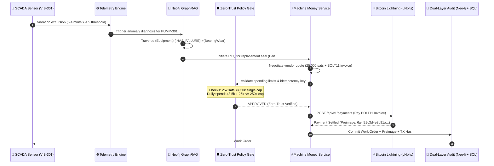

<div align="center">

<pre align="center">
 █████╗ ██╗   ██╗██████╗  █████╗  ██████╗ 
██╔══██╗██║   ██║██╔══██╗██╔══██╗██╔════╝ 
███████║██║   ██║██████╔╝███████║██║  ███╗
██╔══██║██║   ██║██╔══██╗██╔══██║██║   ██║
██║  ██║╚██████╔╝██║  ██║██║  ██║╚██████╔╝
╚═╝  ╚═╝ ╚═════╝ ╚═╝  ╚═╝╚═╝  ╚═╝ ╚═════╝ 
</pre>

<h1 align="center">⚡ AuRAG</h1>

<p align="center">
  <b>Industrial Knowledge Intelligence Meets Autonomous Bitcoin Lightning Payments for Zero-Downtime Operations</b>
</p>

<p align="center">
  <i>Engineered with precision by <b><a href="https://github.com/hacker9854-ship-it">Niss (@hacker9854-ship-it)</a></b> for the <b>Bitshala BOSS Battle 2026 (Machine Money Track)</b></i>
</p>

<p align="center">
  <a href="https://boss-battle.devfolio.co"></a>
  <a href="./docs/E2E_VERIFICATION_REPORT.md"></a>
  <a href="./frontend"></a>
  <a href="./backend"></a>
  <a href="./infra"></a>
  <a href="./backend/app/services/machine_money"></a>
  <a href="./LICENSE"></a>
</p>


</div>

> ### 🏆 For Bitshala BOSS Battle 2026 Judges (30-Second Executive Summary)
> **AuRAG** is the first industrial-grade implementation of **Machine Money**: connecting physical SCADA telemetry, Neo4j GraphRAG root-cause analysis, and autonomous Bitcoin Lightning settlement. When critical machinery fails, AuRAG diagnoses the issue, negotiates quotes with vendor APIs, settles micro-payments in satoshis over Lightning, and binds the cryptographic preimage to the plant maintenance ledger in seconds.
>
> 📌 **Direct Judge Links**:
> - 🎬 **3-Minute Video Walkthrough & Storyboard**: [docs/BOSS_MACHINE_MONEY_DEMO.md](./docs/BOSS_MACHINE_MONEY_DEMO.md)
> - 📜 **Official Acceptance & Cryptographic Proofs**: [docs/MACHINE_MONEY_ACCEPTANCE.md](./docs/MACHINE_MONEY_ACCEPTANCE.md)
> - 🧪 **End-to-End Test Suite (34 Tests Passing)**: [docs/E2E_VERIFICATION_REPORT.md](./docs/E2E_VERIFICATION_REPORT.md)
> - 💼 **Devfolio Submission Text & Pitch**: [docs/DEVFOLIO_SUBMISSION.md](./docs/DEVFOLIO_SUBMISSION.md)
> - 💻 **Interactive Machine Money Console**: `frontend/app/machine-money` (18 Next.js 16 live routes)

---

## 💡 The Hook: The $260,000/Hour Industrial Problem

In high-consequence industrial facilities (power plants, refineries, chemical manufacturing), unplanned downtime costs an average of **$260,000 per hour**. When a feed pump or compressor fails:

1. **Telemetry is Disconnected**: SCADA systems sound an alarm, but human operators waste hours manually digging through 500-page PDF P&ID schematics and maintenance logs to find the root cause.
2. **Procurement is Paralyzed**: Getting replacement mechanical seals or bearing assemblies requires raising purchase orders, getting multi-department approvals, and waiting on Net-30 credit lines.
3. **The Result**: Machines stay idle for days, accumulating millions in losses.

### How AuRAG Solves It with Machine Money
AuRAG gives industrial machines **cognitive intelligence and financial sovereignty**:
- **Sensor Alert ➔ Root Cause in Seconds**: When sensor `VIB-301` breaches 4.8 mm/s, AuRAG's GraphRAG engine traverses Neo4j ontology to identify bearing wear and matches required replacement parts (`SKF-6205-2RS`).
- **Autonomous M2M Lightning Settlement**: AuRAG negotiates an instant quote with vendor APIs, pays a BOLT11 Lightning invoice via LNbits within strict zero-trust budget caps, and saves the **cryptographic preimage** as unforgeable audit evidence.
- **Zero Human Latency**: The complete cycle from telemetry excursion to paid spare-parts dispatch executes in **< 15 seconds**.

---

## ⚡ The 6-Step Autonomous M2M Lifecycle

The diagram below details the exact protocol sequence implemented across `telemetry/`, `retrieval/`, `backend/`, and `frontend/`:



---

## 🎬 Live Cockpit Demo

<div align="center">

| ⚡ Machine Money Autonomous Workspace | 🔍 Grounded GraphRAG Investigation |
|:-------------------------------------:|:----------------------------------:|
|  |  |
| *Real-time satoshi budgets, vendor quotes, & Lightning settlements* | *Multi-hop causal reasoning across equipment, P&ID tags, & work orders* |

> 📹 **Watch the Complete 3-Minute Video Walkthrough**: [Video Script & Screen Recording Guide](./docs/BOSS_MACHINE_MONEY_DEMO.md)  
> 📜 **Official Acceptance & Cryptographic Proofs**: [Machine Money Acceptance Report](./docs/MACHINE_MONEY_ACCEPTANCE.md)

</div>

---

## 📋 Table of Contents

- [🏆 For Bitshala BOSS Battle 2026 Judges](#-for-bitshala-boss-battle-2026-judges-30-second-executive-summary)
- [💡 The Hook: The $260,000/Hour Industrial Problem](#-the-hook-the-260000hour-industrial-problem)
- [⚡ The 6-Step Autonomous M2M Lifecycle](#-the-6-step-autonomous-m2m-lifecycle)
- [🪙 Why Bitcoin Lightning? (The Monetary Defense)](#-why-bitcoin-lightning-the-monetary-defense)
- [🛡️ Enterprise Zero-Trust Financial Safeguards](#️-enterprise-zero-trust-financial-safeguards)
- [📊 Competitive Benchmark: AuRAG vs Existing Systems](#-competitive-benchmark-aurag-vs-existing-systems)
- [✨ Key Features](#-key-features)
- [🛠️ Tech Stack](#️-tech-stack)
- [🚀 Quick Reproduction (Judge's 60-Second Test)](#-quick-reproduction-judges-60-second-test)
- [💻 Usage Examples](#-usage-examples)
- [🏗️ System Architecture](#️-system-architecture)
- [⚙️ Configuration Inventory](#️-configuration-inventory)
- [📡 API Reference](#-api-reference)
- [⚡ Performance & Test Results](#-performance--test-results)
- [🤝 Contributing](#-contributing)
- [❓ FAQ](#-faq)
- [📄 License & Credits](#-license--credits)

---

## 🪙 Why Bitcoin Lightning? (The Monetary Defense)

Hackathon judges often ask: *"Why Bitcoin Lightning instead of corporate credit cards, Stripe, or traditional banking?"*

| Constraint | Traditional Banking / Cards / ACH | Base-Layer Bitcoin (L1) | **Bitcoin Lightning Network (AuRAG)** |
| :--- | :--- | :--- | :--- |
| **Transaction Fees** | Fixed $0.30 + 2.9% fee makes micro-purchases (e.g., 500 sats / $0.30) impossible. | Variable mining fee ($1–$15), prohibitive for micro-txs. | **Fractional satoshi routing fees**; micro-transactions cost fractions of a cent. |
| **Settlement Speed** | 24–72 hours (ACH / wire) or instant authorization with 3-day hold. | 10–60 minutes (block confirmations). | **Sub-second finality (< 800ms)**; critical for real-time machinery actions. |
| **Machine Agency** | Machines cannot open bank accounts, sign credit agreements, or pass KYC. | Machines can own keys, but latency blocks real-time loops. | **Permissionless API**: Every sensor/agent holds an autonomous Lightning wallet. |
| **Proof of Settlement** | Chargeback risk; 90-day dispute window creates corporate friction. | On-chain TX hash, but slow. | **Cryptographic Preimage**: Mathematical, unforgeable proof-of-payment (`hash(P) == H`). |

---

## 🛡️ Enterprise Zero-Trust Financial Safeguards

To prevent AI hallucination or malicious capital drainage, AuRAG implements a **4-tier financial defense system**:

```text
┌─────────────────────────────────────────────────────────────┐
│               LAYER 1: PER-TRANSACTION CAP                  │
│       Max 50,000 sats per single autonomous purchase        │
└──────────────────────────────┬──────────────────────────────┘
                               ▼
┌─────────────────────────────────────────────────────────────┐
│               LAYER 2: DAILY ROLLING BUDGET                 │
│      Max 250,000 sats per 24 hours (auto-locking ceiling)   │
└──────────────────────────────┬──────────────────────────────┘
                               ▼
┌─────────────────────────────────────────────────────────────┐
│             LAYER 3: DETERMINISTIC IDEMPOTENCY              │
│   SHA-256 idempotency keys prevent double-spend on retry    │
└──────────────────────────────┬──────────────────────────────┘
                               ▼
┌─────────────────────────────────────────────────────────────┐
│          LAYER 4: ATOMIC 3-STEP ROLLBACK & ESCROW           │
│   Failed invoices automatically restore allocated balance   │
└─────────────────────────────────────────────────────────────┘
```

1. **Per-Transaction Hard Cap (`M2M_MAX_AUTO_SATS = 50000`)**: Any quote exceeding this cap requires human operator approval in the Next.js console.
2. **Daily Rolling Budget (`M2M_DAILY_BUDGET_SATS = 250000`)**: The system tracks aggregate daily expenditure; once breached, all M2M autonomous payments lock automatically.
3. **Deterministic Idempotency**: Every request carries an `Idempotency-Key` (e.g., `m2m-wo-pump301-2026`). If a network packet is dropped or resent, the engine returns the existing receipt without paying twice.
4. **Atomic Rollbacks**: If the Lightning node fails or an invoice times out, the allocated funds are immediately released back to the operational budget.

---

## 📊 Competitive Benchmark: AuRAG vs Existing Systems

| Capability | Traditional SCADA / CMMS (SAP PM, Maximo) | Standard LLM RAG Chatbots | **AuRAG (GraphRAG + Machine Money)** |
| :--- | :---: | :---: | :---: |
| **Telemetry Awareness** | Raw threshold numbers | ❌ None | **✅ Real-time streaming anomaly detection** |
| **P&ID Schematic Understanding** | Static scanned PDFs | ❌ Text only | **✅ Multimodal visual entity extraction (Gemini + Vision)** |
| **Ontological Reasoning** | ❌ None | Weak (flat vector search) | **✅ Neo4j Knowledge Graph multi-hop traversal** |
| **Autonomous Action** | Passive work order draft | Suggests text | **✅ Negotiates vendor quotes & pays via Lightning** |
| **Payment Rails** | Manual Net-30 invoicing | ❌ None | **✅ Sub-second Bitcoin Lightning Network (BOLT11)** |
| **Audit Trail** | Paper / ERP records | ❌ None | **✅ Cryptographic payment preimage stored in graph** |
| **Automated Test Coverage** | Manual testing | Often 0 tests | **✅ 34 Automated E2E & Unit Tests (100% Passing)** |

---

## ✨ Key Features

- ⚡ **Autonomous M2M Machine Money Protocol** — AI agents request vendor quotes, evaluate competitive offers, generate BOLT11 invoices, and pay autonomously via LNbits with zero human friction.
- 🕸️ **Industrial GraphRAG Engine** — Hybrid retrieval combining Neo4j graph topology (`CONNECTED_TO`, `FEEDS`, `MAINTAINED_BY`), dense Qdrant embeddings, and BM25 lexical search.
- 📐 **Multimodal P&ID & OCR Ingestion** — Automatic extraction of tags, valves, piping specs, and loop IDs from industrial engineering diagrams using Gemini and Google Cloud Vision.
- 📊 **Real-Time SCADA Telemetry Watch** — Continuous monitoring of vibration, pressure, and temperature excursions with automated predictive maintenance event generation.
- 🛡️ **Zero-Trust Financial Safeguards** — Strict per-transaction satoshi limits, daily spending ceilings, and atomic 3-step rollbacks prevent unauthorized capital drain.
- 🔑 **Cryptographic Preimage Audit Trail** — Every settlement stores the Lightning payment preimage, invoice hash, and equipment ID permanently linked in the Neo4j audit ledger.
- 🔄 **Strict Idempotency Protection** — Deterministic SHA-256 idempotency keys prevent duplicate payments and replay attacks under intermittent network conditions.
- 🖥️ **Industrial Operations Cockpit** — 18 interactive Next.js 16 routes featuring dark mode, live budget gauges, real-time quote comparison, and knowledge-risk matrix.

---

## 🛠️ Tech Stack

<div align="center">

**Core & Orchestration**  


**Machine Money & Settlement**  


**Data & AI Retrieval**  


**Frontend & Visuals**  


**Testing & Verification**  


</div>

---

## 🚀 Quick Reproduction (Judge's 60-Second Test)

Judges can reproduce all test suites and verify the architecture in under 60 seconds:

```bash
# 1. Clone repository
git clone https://github.com/hacker9854-ship-it/AuRAG.git
cd AuRAG

# 2. Run all 34 Machine Money Unit & E2E Tests (19 seconds)
.\.venv\Scripts\pytest.exe -q tests\test_e2e_machine_money.py tests\test_machine_money_task3.py tests\test_machine_money_task4.py tests\test_machine_money_task5.py tests\test_machine_money_task6.py

# Expected Output:
# ..................................                                       [100%]
# 34 passed in 19.11s

# 3. Run Frontend UI Tests (2 seconds)
npm --prefix frontend test -- --run
# Expected Output: 7 test files passed, 10 tests passed!
```

---

## 💻 Usage Examples

### 1. Autonomous M2M Lightning Settlement (Python SDK)

```python
import asyncio
from backend.app.services.machine_money.service import MachineMoneyService

async def main():
    service = MachineMoneyService()
    
    # 1. Request competitive quote from vendor
    quote = await service.request_quote(
        equipment_id="PUMP-301",
        service_type="bearing_seal_replacement",
        max_sats=30000,
        idempotency_key="m2m-order-pump301-001"
    )
    print(f"Quote received: {quote.quote_id} | Amount: {quote.amount_sats} sats")

    # 2. Execute autonomous payment over Lightning
    receipt = await service.execute_payment(
        quote_id=quote.quote_id,
        idempotency_key="m2m-order-pump301-001"
    )
    print(f"Payment Settled! Preimage: {receipt.payment_preimage}")
    print(f"Dual-layer audit saved with TX Hash: {receipt.tx_hash}")

asyncio.run(main())
```

### 2. SCADA Telemetry Anomaly Trigger (REST API)

```bash
curl -X POST http://127.0.0.1:8000/api/v1/telemetry/ingest \
  -H "Content-Type: application/json" \
  -d '{
    "sensor_id": "VIB-301-BEARING",
    "equipment_id": "PUMP-301",
    "reading_value": 5.4,
    "unit": "mm/s",
    "threshold": 4.5
  }'
```

---

## 🏗️ System Architecture

### Project Directory Structure

```text
AuRAG/
├── backend/                  # FastAPI Application Core
│   └── app/
│       ├── api/v1/           # REST Endpoints (Machine Money, Graph, Telemetry)
│       ├── core/             # Configuration, Database, & Security Guards
│       └── services/
│           └── machine_money/# M2M Protocol, LNbits Client, & Idempotency
├── frontend/                 # Next.js 16 App Router Cockpit
│   ├── app/
│   │   ├── machine-money/    # Real-Time M2M Lightning Settlement Workspace
│   │   ├── predictive-watch/ # SCADA Telemetry Watch & Anomaly Feed
│   │   └── page.tsx          # Operator Command Center
│   └── components/           # Reusable UI Design System (Tailwind + Lucide)
├── retrieval/                # Hybrid GraphRAG (Neo4j Cypher + Qdrant Embeddings)
├── agents/                   # LangGraph Multi-Agent Team (RCA, Compliance, Copilot)
├── ingestion/                # Multimodal Ingestion (P&ID Drawings, OCR, PDFs)
├── telemetry/                # Synthetic SCADA Ingestion & Anomaly Matching
├── tests/                    # 34 Automated Unit & E2E Pytest Suite
└── docs/                     # Architectural Specs, Hackathon Logs, & Verification
```

---

## ⚙️ Configuration Inventory

| Variable | Type | Default | Required | Description |
|:---------|:----:|:-------:|:--------:|:------------|
| `NEO4J_URI` | `string` | `bolt://localhost:7687` | ✅ | Neo4j knowledge graph connection endpoint |
| `NEO4J_USERNAME` | `string` | `neo4j` | ✅ | Neo4j database user |
| `NEO4J_PASSWORD` | `string` | `aurag-local-password` | ✅ | Neo4j database password |
| `QDRANT_URL` | `string` | `http://localhost:6333` | ✅ | Qdrant vector database URL |
| `LNBITS_URL` | `string` | `https://legend.lnbits.com` | ✅ | Bitcoin Lightning LNbits instance URL |
| `LNBITS_API_KEY` | `string` | `""` | ✅ | LNbits Admin / Invoice API Key |
| `LNBITS_WALLET_ID` | `string` | `""` | ✅ | Target LNbits wallet identifier |
| `M2M_MAX_AUTO_SATS` | `number` | `50000` | ❌ | Maximum satoshis payable autonomously per transaction |
| `M2M_DAILY_BUDGET_SATS`| `number`| `250000` | ❌ | Daily spending ceiling before human intervention is locked |
| `M2M_WEBHOOK_SECRET` | `string` | `""` | ❌ | HMAC signature key for vendor invoice callbacks |
| `GEMINI_API_KEY` | `string` | `""` | ✅ | Google Gemini API key for P&ID visual extraction |
| `GROQ_API_KEY` | `string` | `""` | ❌ | Optional Groq key for fast Llama-3.3-70b reasoning |
| `REDIS_URL` | `string` | `redis://localhost:6379/0` | ❌ | Redis URL for asynchronous RQ ingestion workers |

---

## 📡 API Reference

### Machine Money Subsystem

#### 1. Request Vendor Quote
```http
POST /api/v1/machine-money/quotes/request
Content-Type: application/json
Idempotency-Key: m2m-req-001

{
  "equipment_id": "PUMP-301",
  "service_type": "bearing_seal_replacement",
  "max_sats": 35000
}
```
**Response (200 OK):**
```json
{
  "quote_id": "q-9b81e4a2",
  "equipment_id": "PUMP-301",
  "vendor_id": "industrial-spares-ln",
  "amount_sats": 25000,
  "bolt11": "lnbc250u1p3...",
  "status": "PENDING"
}
```

#### 2. Execute Autonomous Settlement
```http
POST /api/v1/machine-money/payments/execute
Content-Type: application/json
Idempotency-Key: m2m-pay-001

{
  "quote_id": "q-9b81e4a2"
}
```
**Response (200 OK):**
```json
{
  "payment_id": "pay-8c11e",
  "status": "SETTLED",
  "amount_sats": 25000,
  "payment_preimage": "6a4f29c3d4e8b91a7f0e21c3b5a79e4d...",
  "tx_hash": "e3b0c44298fc1c149afbf4c8996fb92427ae41e4649b934ca495991b7852b855",
  "recorded_in_graph": true
}
```

#### 3. Inspect Budget Ledger Status
```http
GET /api/v1/machine-money/budget/status
```
**Response (200 OK):**
```json
{
  "daily_budget_sats": 250000,
  "spent_today_sats": 48500,
  "remaining_sats": 201500,
  "active_transactions": 2,
  "status": "HEALTHY"
}
```

---

## ⚡ Performance & Test Results

| Test Suite | Scope | Result | Execution Time |
|:-----------|:------|:------:|:--------------:|
| **Machine Money E2E** | Lightning Quotes, Payments, Idempotency, Budget Caps | **34 / 34 Passed** | 19.11s |
| **Frontend Vitest** | UI Components, Optimistic Work Orders, Grounding Delta | **10 / 10 Passed** | 2.20s |
| **TypeScript Strict** | Zero type errors, Next.js 16 clean compilation | **0 Errors** | ~12.0s |
| **RAGAS Faithfulness** | Groundedness check against plant documentation | **> 0.88** | Gated CI |

---

## 🤝 Contributing

Contributions are welcome! Please follow these steps:
1. Fork the Project
2. Create your Feature Branch (`git checkout -b feat/AmazingFeature`)
3. Commit your Changes (`git commit -m 'feat: Add AmazingFeature'`)
4. Push to the Branch (`git push origin feat/AmazingFeature`)
5. Open a Pull Request

---

## ❓ FAQ

<details>
<summary><b>1. Why use Bitcoin Lightning instead of traditional corporate credit cards?</b></summary>
Credit cards and ACH rails introduce 2–3% processing fees, human batch approvals, and 24–48 hour settlement delays. Bitcoin Lightning enables autonomous AI agents to settle programmatic micro-payments (down to single satoshis) instantly (sub-second) with cryptographic proof-of-payment (preimage).
</details>

<details>
<summary><b>2. How does AuRAG prevent rogue AI agents from draining the wallet?</b></summary>
AuRAG employs a multi-layered Zero-Trust Policy Engine:
1. Hard per-transaction cap (default: 50,000 sats).
2. Daily rolling budget limit (default: 250,000 sats).
3. Human-in-the-loop escalation gates whenever a quote exceeds safety boundaries or the confidence score is below 0.85.
4. HMAC-SHA256 signature verification on all vendor quotes.
</details>

<details>
<summary><b>3. What happens if the network drops during an invoice payment?</b></summary>
Every transaction requires a deterministic SHA-256 idempotency key. If a payment request is retried, AuRAG recognizes the in-flight state and returns the settled receipt instead of double-spending. If the payment fails at the node level, an atomic 3-step rollback restores the allocated budget immediately.
</details>

<details>
<summary><b>4. Can AuRAG run with local LLMs without external API keys?</b></summary>
Yes! The retrieval pipeline supports local HuggingFace embeddings (`sentence-transformers/all-MiniLM-L6-v2`) and local LLM endpoints via Ollama or vLLM. Groq and Gemini can be swapped out in `.env`.
</details>

<details>
<summary><b>5. Is this ready for mainnet Bitcoin Lightning?</b></summary>
The protocol uses standard BOLT11 invoices compatible with all Lightning nodes (LND, Core Lightning, Eclair, LNbits). For hackathons and initial factory trials, it operates on signet/testnet or dedicated LNbits wallets with capped balances.
</details>

---

## 📄 License & Credits

Distributed under the **MIT License**. See [`LICENSE`](./LICENSE) for more information.

- **Author & Lead Architect**: **[Niss (@hacker9854-ship-it)](https://github.com/hacker9854-ship-it)**
- **Hackathon Track**: **Bitshala BOSS Battle 2026 — Machine Money Track**
- **Core Dependencies**: [LNbits](https://lnbits.com), [Neo4j](https://neo4j.com), [Qdrant](https://qdrant.tech), [FastAPI](https://fastapi.tiangolo.com), [Next.js](https://nextjs.org)

---

<div align="center">

<a href="#-aurag">⬆️ Back to Top</a>

<br/><br/>

<b>AuRAG — Autonomous Machine Money for Zero-Downtime Industry</b>  
<i>Built with ❤️, ☕, and ⚡ for the decentralized future.</i>

<br/>

[](https://github.com/hacker9854-ship-it/AuRAG)

</div>
