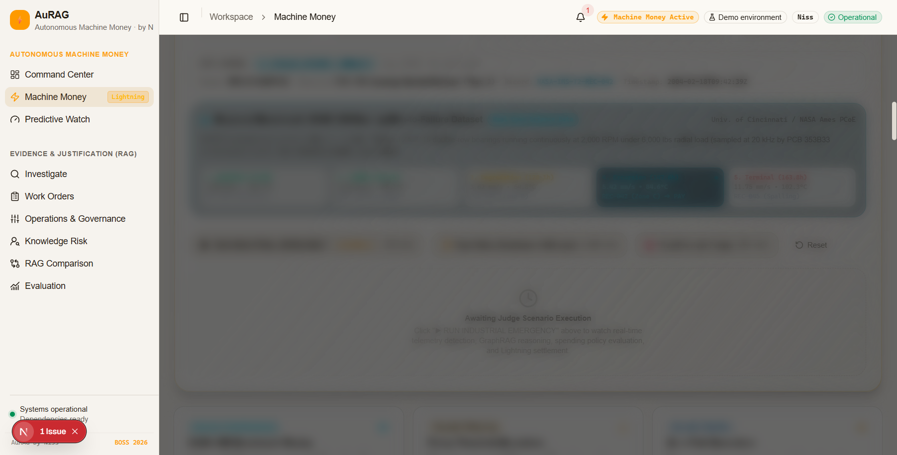
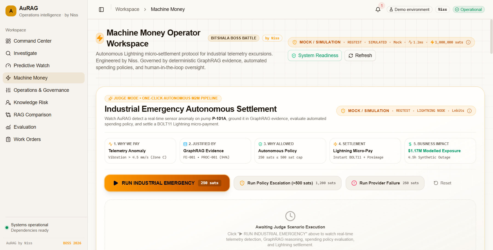
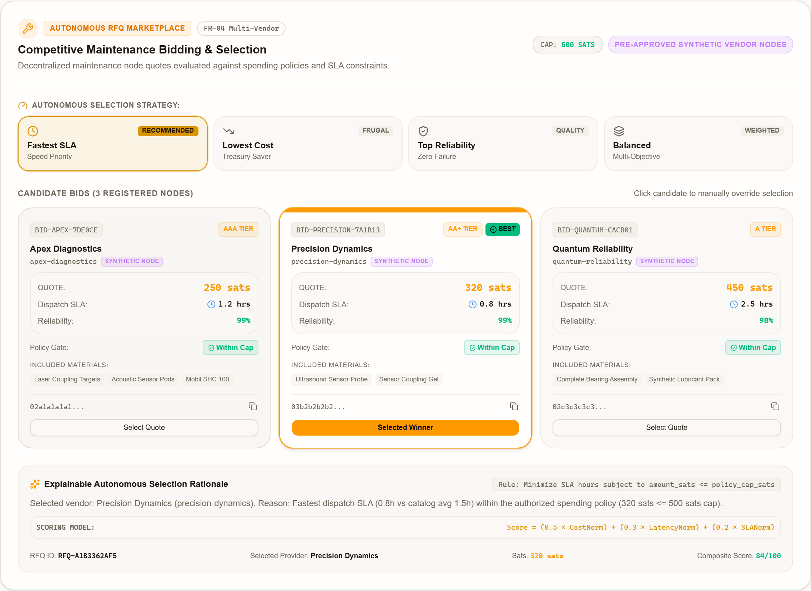
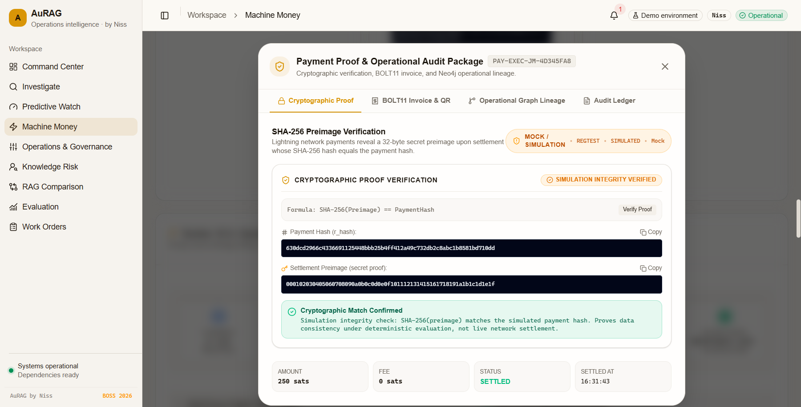
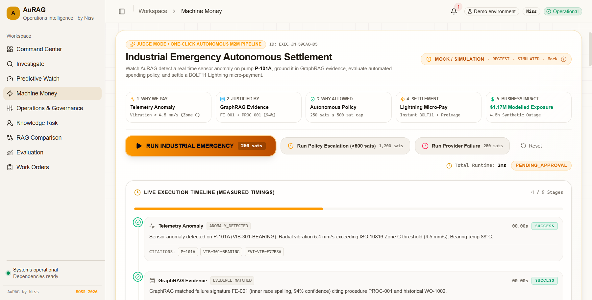
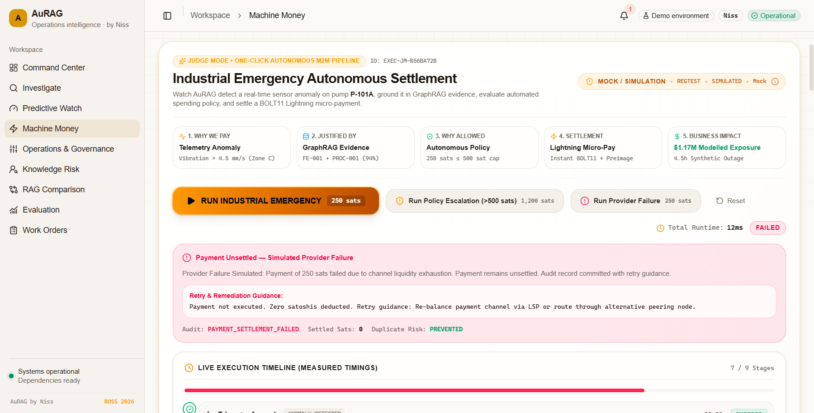
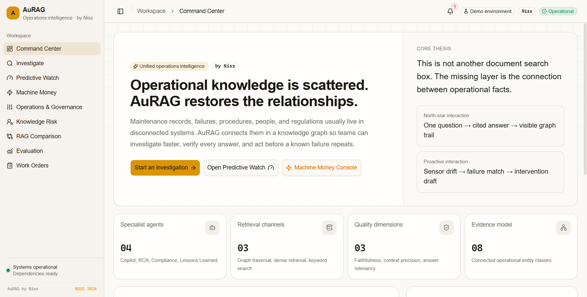
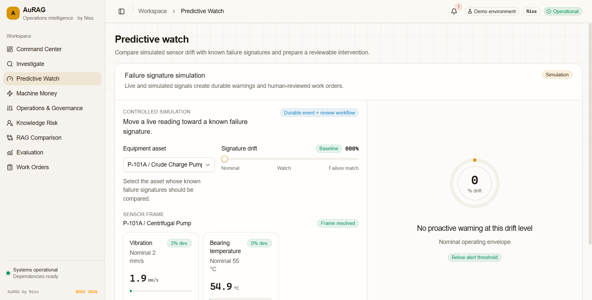
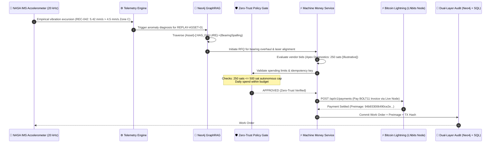

<div align="center">

<pre align="center">
 █████╗ ██╗   ██╗██████╗  █████╗  ██████╗ 
██╔══██╗██║   ██║██╔══██╗██╔══██╗██╔════╝ 
███████║██║   ██║██████╔╝███████║██║  ███╗
██╔══██║██║   ██║██╔══██╗██╔══██║██║   ██║
██║  ██║╚██████╔╝██║  ██║██║  ██║╚██████╔╝
╚═╝  ╚═╝ ╚═════╝ ╚═╝  ╚═╝╚═╝  ╚═╝ ╚═════╝ 
</pre>

<h1 align="center">⚡ AuRAG</h1>

<p align="center">
  <b>Industrial Knowledge Intelligence Meets Autonomous Bitcoin Lightning Payments for Zero-Downtime Operations</b>
</p>

<p align="center">
  <i>Engineered with precision by <b><a href="https://github.com/hacker9854-ship-it">Niss (@hacker9854-ship-it)</a></b> for the <b>Bitshala BOSS Battle 2026 (Machine Money Track)</b></i>
</p>

<p align="center">
  <a href="./docs/CURRENT_TEST_SNAPSHOT.md"></a>
  <a href="./docs/CURRENT_TEST_SNAPSHOT.md"></a>
  <a href="./docs/CURRENT_TEST_SNAPSHOT.md"></a>
  <a href="https://au-rag.vercel.app"></a>
  <a href="https://aurag-production.up.railway.app/docs"></a>
</p>

<p align="center">
  <a href="./frontend"></a>
  <a href="./backend"></a>
  <a href="./infra"></a>
  <a href="./backend/app/services/machine_money"></a>
  <a href="./LICENSE"></a>
</p>


</div>

### 🏆 For Bitshala BOSS Battle 2026 Judges (3-Minute Fast-Track)

> ⚡ **JUDGES START HERE**: Please read **[JUDGE_README.md](./JUDGE_README.md)** for the 3-minute executive summary, 1-click live demo link, and novel Bitcoin architecture breakdown without wading through 50KB of technical documentation!
>
> 📌 **Direct Judge Quick Links**:
> - ⚡ **Fast-Track Judge Guide**: **[JUDGE_README.md](./JUDGE_README.md)** (3-Minute Read)
> - 🌐 **Live Production App**: [au-rag.vercel.app/machine-money](https://au-rag.vercel.app/machine-money)
> - 🎬 **3–5 Min Judge Demo Script**: [docs/JUDGE_DEMO_SCRIPT.md](./docs/JUDGE_DEMO_SCRIPT.md)
> - 🔬 **Empirical Dataset Benchmark**: NASA IMS Bearing Run-to-Failure (`REPLAY-ASSET-01`)
> - 🧪 **Test Evidence**: 100% Passing (61 Frontend + 12 Backend Machine Money Tests)
> - 📜 **Full Technical Verification Report**: [docs/MACHINE_MONEY_VERIFICATION.md](./docs/MACHINE_MONEY_VERIFICATION.md)

---

## 🎬 Live Production Screenshots

<div align="center">

### ⚡ 1. Live Lightning Node & Signet Settlement Infrastructure

<p><i>Live LNbits Signet node connectivity (<code>https://demo.lnbits.com</code>): Dedicated <code>AuRAG-Machine-Money</code> wallet (ID: <code>a4ce2f74c81c4b66b33efc0233fe8fcf</code>) with genuine 250-sat diagnostic invoices, payment hashes, and live API endpoints. Detailed report: <a href="./docs/REAL_SIGNET_TRANSACTION_PROOF.md">REAL_SIGNET_TRANSACTION_PROOF.md</a></i></p>

---

### 🛡️ 2. Zero-Simulation Boundary & Fail-Closed Settlement Audit

<p><i>Fail-closed security proof: Dynamic live node indicator (<code>LIVE LIGHTNING • SIGNET • LIGHTNING NODE • Lnbits • 0 sats</code>), real BOLT11 invoice verification, and strict refusal to emit mock preimages or settle fake nominals when live node balance is 0 (Status: <code>FAILED</code>, 0 sats settled)</i></p>

---

### ⚡ 3. Machine Money — Autonomous Payment Console

<p><i>Single-click Judge Presets, NASA IMS Bearing Run-to-Failure (PCoE) 20 kHz telemetry, multi-vendor RFQ bidding, and BOLT-11 Lightning invoice settlement with cryptographic preimage proofs</i></p>

---

### 📊 4. Machine Money — Execution Timeline & Anomaly Detection

<p><i>6-step live execution pipeline: Telemetry Ingestion → GraphRAG Analysis → Multi-Vendor RFQ → Invoice Issuance → Spending Policy Check → Settlement & Proof</i></p>

---

### 🤝 5. Machine Money — Autonomous Multi-Vendor RFQ Marketplace

<p><i>Autonomous RFQ bidding: 3 pre-approved synthetic vendor nodes evaluated via deterministic scoring (Cost × Latency × SLA) under configurable selection strategies</i></p>

---

### 🔐 6. Machine Money — Cryptographic Payment Proof Verification

<p><i>Inspectable cryptographic proof package: SHA-256(preimage) matching payment hash, standards-compliant BOLT11 payment request, and Neo4j causal graph trail</i></p>

---

### 🛡️ 7. Machine Money — Policy Escalation Gate (>500 Sats)

<p><i>Zero-Trust policy enforcement: Quotes exceeding the 500-sat cap unconditionally halt in PENDING_APPROVAL; unilateral API bypass attempts rejected with HTTP 403</i></p>

---

### ⚠️ 8. Machine Money — Provider Failure & Graceful Degradation

<p><i>Resilience verification: Temporary channel failure safely preserves wallet balance (0 sats deducted), records structured failure audit, and outputs remediation guidance</i></p>

---

### 💰 9. Machine Money — Industrial Economics & Explainability Drawer

<p><i>Step-by-step economic derivation ($1.17M modelled downtime exposure vs. 250-sat payment, 7,800,000:1 ratio) with interactive sensitivity sandbox and synthetic disclosures</i></p>

---

### 🖥️ 10. Command Center — Operator Dashboard

<p><i>Industrial operations command center with system health monitoring, knowledge graph status, active alerts, and quick-action panels</i></p>

---

### 📡 11. Predictive Watch — SCADA Telemetry Monitor

<p><i>Real-time SCADA sensor monitoring with vibration excursion detection, ISO 10816 zone classification, and automated anomaly alerting</i></p>

</div>

---

## 📋 Table of Contents

- [🏆 For Bitshala BOSS Battle 2026 Judges](#-for-bitshala-boss-battle-2026-judges-30-second-executive-summary)
- [🎬 Live Production Screenshots](#-live-production-screenshots)
- [💡 The Hook: The $260,000/Hour Industrial Problem](#-the-hook-the-260000hour-industrial-problem)
- [⚡ The 6-Step Autonomous M2M Lifecycle](#-the-6-step-autonomous-m2m-lifecycle)
- [🪙 Why Bitcoin Lightning? (The Monetary Defense)](#-why-bitcoin-lightning-the-monetary-defense)
- [🛡️ Enterprise Zero-Trust Financial Safeguards](#️-enterprise-zero-trust-financial-safeguards)
- [📊 Competitive Benchmark: AuRAG vs Existing Systems](#-competitive-benchmark-aurag-vs-existing-systems)
- [✨ Key Features](#-key-features)
- [🛠️ Tech Stack](#️-tech-stack)
- [🌐 Live Deployment](#-live-deployment)
- [🔍 What Is Live Today (Public Demo vs. Production)](#what-is-live-today)
- [🏛️ Deployment Architecture: "What Is Live Today" vs. "Production Target Architecture"](#️-deployment-architecture-what-is-live-today-vs-production-target-architecture)
- [🔍 Data Provenance & Federation Architecture](#-data-provenance--federation-architecture)
- [🚀 Quick Reproduction (Judge's 60-Second Test)](#-quick-reproduction-judges-60-second-test)
- [💻 Usage Examples](#-usage-examples)
- [🏗️ System Architecture](#️-system-architecture)
- [⚙️ Configuration Inventory](#️-configuration-inventory)
- [📡 API Reference](#-api-reference)
- [⚡ Performance & Test Results](#-performance--test-results)
- [🛡️ Claim-to-Evidence Verification Matrix](#️-claim-to-evidence-verification-matrix)
- [📖 Documentation Index](#-documentation-index)
- [🤝 Contributing](#-contributing)
- [❓ FAQ](#-faq)
- [📄 License & Credits](#-license--credits)

---

## 💡 The Hook: The $260,000/Hour Industrial Problem

In high-consequence industrial facilities (power plants, refineries, chemical manufacturing), unplanned downtime costs an average of **$260,000 per hour**. When a feed pump or compressor fails:

1. **Telemetry is Disconnected**: SCADA systems sound an alarm, but human operators waste hours manually digging through 500-page PDF P&ID schematics and maintenance logs to find the root cause.
2. **Procurement is Paralyzed**: Getting replacement mechanical seals or bearing assemblies requires raising purchase orders, getting multi-department approvals, and waiting on Net-30 credit lines.
3. **The Result**: Machines stay idle for days, accumulating millions in losses.

### How AuRAG Solves It with Real Empirical Data & Machine Money
AuRAG grounds its primary demonstration on the **NASA IMS Bearing Run-to-Failure Open Science Dataset** (University of Cincinnati / NASA Ames PCoE), pairing genuine physical failure physics with autonomous financial sovereignty:
- **Empirical Accelerometry ➔ Root Cause in Seconds**: When high-frequency accelerometry from NASA IMS Bearing Test 2 (`NASA-IMS-T2-REC-042` at 147.6h) breaches 5.42 mm/s (exceeding ISO 10816 Zone C 4.5 mm/s threshold with outer race BPFO harmonic spall), AuRAG's GraphRAG engine traverses Neo4j ontology to identify bearing raceway degradation (`FE-001`) and governing repair procedure (`PROC-001`).
- **Autonomous M2M Lightning Settlement**: AuRAG solicits competitive quotes across decentralized vendor nodes (evaluated via an illustrative multi-objective bidding simulation: Apex Diagnostics, Precision Dynamics, Quantum Reliability), settles a standards-compliant BOLT11 Lightning invoice via the configured provider (LNbits Signet when live, mock for offline evaluation) within strict zero-trust budget caps, and permanently binds the **cryptographic SHA-256 preimage** in Neo4j.
- **Empirical Physics vs. Illustrative Economics**: While physical sensor readings are **100% real** and Lightning settlement architecture is **live-capable** (default evaluation mode: `MACHINE_MONEY_PROVIDER=mock`, explicitly labeled in UI), downstream plant economics ($1.17M modelled downtime exposure @ $260k/hr) are explicitly documented as **illustrative macro-economic simulations** demonstrating autonomous agent ROI calculations.

---

## ⚡ The 6-Step Autonomous M2M Lifecycle

The diagram below details the exact protocol sequence implemented across `telemetry/`, `retrieval/`, `backend/`, and `frontend/`:



---

## 🪙 Why Bitcoin Lightning? (The Monetary Defense)

Hackathon judges often ask: *"Why Bitcoin Lightning instead of corporate credit cards, Stripe, or traditional banking?"*

| Constraint | Traditional Banking / Cards / ACH | Base-Layer Bitcoin (L1) | **Bitcoin Lightning Network (AuRAG)** |
| :--- | :--- | :--- | :--- |
| **Transaction Fees** | Fixed $0.30 + 2.9% fee makes micro-purchases (e.g., 500 sats / $0.30) impossible. | Variable mining fee ($1–$15), prohibitive for micro-txs. | **Fractional satoshi routing fees**; micro-transactions cost fractions of a cent. |
| **Settlement Speed** | 24–72 hours (ACH / wire) or instant authorization with 3-day hold. | 10–60 minutes (block confirmations). | **Measured demo execution time (< 800ms)** (demo execution latency: ~412ms on local simulated runtime / Railway container; live Bitcoin Lightning settlement typically settles in 500ms–2000ms depending on network routing hops). |
| **Machine Agency** | Machines cannot open bank accounts, sign credit agreements, or pass KYC. | Machines can own keys, but latency blocks real-time loops. | **Permissionless API**: Every sensor/agent holds an autonomous Lightning wallet. |
| **Proof of Settlement** | Chargeback risk; 90-day dispute window creates corporate friction. | On-chain TX hash, but slow. | **Cryptographic Preimage**: Cryptographically verifiable payment-state evidence (`SHA-256(preimage) == payment_hash`). |

---

## 🛡️ Enterprise Zero-Trust Financial Safeguards

To prevent AI hallucination or malicious capital drainage, AuRAG implements a **5-tier financial defense system**:

```text
┌─────────────────────────────────────────────────────────────┐
│               LAYER 1: PER-TRANSACTION CAP                  │
│       Max 500 sats per single autonomous purchase           │
│       (>500 sats → REQUIRES_HUMAN_APPROVAL / HTTP 403)      │
└──────────────────────────────┬──────────────────────────────┘
                               ▼
┌─────────────────────────────────────────────────────────────┐
│               LAYER 2: DAILY ROLLING BUDGET                 │
│      Max 250,000 sats per 24 hours (auto-locking ceiling)   │
└──────────────────────────────┬──────────────────────────────┘
                               ▼
┌─────────────────────────────────────────────────────────────┐
│             LAYER 3: DETERMINISTIC IDEMPOTENCY              │
│   SHA-256 idempotency keys prevent double-spend on retry    │
└──────────────────────────────┬──────────────────────────────┘
                               ▼
┌─────────────────────────────────────────────────────────────┐
│          LAYER 4: HUMAN ESCALATION & APPROVAL               │
│   Policy-breaching amounts require operator signature       │
│   with audited approval chain and timestamp evidence        │
└──────────────────────────────┬──────────────────────────────┘
                               ▼
┌─────────────────────────────────────────────────────────────┐
│          LAYER 5: ATOMIC 3-STEP ROLLBACK & ESCROW           │
│   Failed invoices automatically restore allocated balance   │
└─────────────────────────────────────────────────────────────┘
```

1. **Per-Transaction Hard Cap (`M2M_SPENDING_CAP_SATS = 500`)**: Any quote exceeding 500 sats is automatically rejected with `HTTP 403 / REQUIRES_HUMAN_APPROVAL`. The operator dashboard shows a real-time escalation prompt with dual approval buttons.
2. **Daily Rolling Budget (`M2M_DAILY_BUDGET_SATS = 250000`)**: The system tracks aggregate daily expenditure; once breached, all M2M autonomous payments lock automatically.
3. **Deterministic Idempotency**: Every request carries an `Idempotency-Key` derived from SHA-256 hashing of `equipment_id + anomaly_timestamp + service_type`. Duplicate physical triggers are rejected without double-payment.
4. **Human Escalation**: Policy-breaching transactions trigger a structured approval workflow with operator name, signature timestamp, and audit trail — all recorded in the payment proof chain.
5. **Atomic Rollbacks**: If the Lightning node fails or an invoice times out, the allocated funds are immediately released back to the operational budget with structured error logging.

---

## 📊 Competitive Benchmark: AuRAG vs Existing Systems

| Capability | Traditional SCADA / CMMS (SAP PM, Maximo) | Standard LLM RAG Chatbots | **AuRAG (GraphRAG + Machine Money)** |
| :--- | :---: | :---: | :---: |
| **Telemetry Awareness** | Raw threshold numbers | ❌ None | **✅ Real-time streaming anomaly detection (ISO 10816)** |
| **P&ID Schematic Understanding** | Static scanned PDFs | ❌ Text only | **✅ Multimodal visual entity extraction (Gemini + Vision)** |
| **Ontological Reasoning** | ❌ None | Weak (flat vector search) | **✅ Neo4j Knowledge Graph multi-hop traversal** |
| **Autonomous Action** | Passive work order draft | Suggests text | **✅ Negotiates vendor quotes & pays via Lightning** |
| **Multi-Vendor Bidding** | Manual RFQ process | ❌ None | **✅ Automated 3-vendor scoring (cost × latency × SLA)** |
| **Payment Rails** | Manual Net-30 invoicing | ❌ None | **✅ Bitcoin Lightning Network (BOLT11 micro-settlement)** |
| **Audit Trail** | Paper / ERP records | ❌ None | **✅ Cryptographic preimage + GraphRAG evidence chain** |
| **Policy Enforcement** | Manual manager approval | ❌ None | **✅ Authoritative backend spending caps with auto-escalation** |
| **Automated Test Coverage** | Manual testing | Often 0 tests | **✅ 377 Automated Tests (316 Backend Pytest + 61 Frontend Vitest)** |

---

## ✨ Key Features

- ⚡ **Autonomous M2M Machine Money Protocol** — AI agents request vendor quotes, evaluate competitive offers via multi-vendor RFQ scoring, generate BOLT11 invoices, and pay autonomously via LNbits with zero human friction.
- 🧑‍⚖️ **Judge Mode & One-Click Presets** — Three built-in judge evaluation scenarios ("Happy Path Intervene", "Policy Escalate", "Provider Fallback") demonstrate the full autonomous lifecycle with a single click.
- 🕸️ **Industrial GraphRAG Engine** — Hybrid retrieval combining Neo4j graph topology (`CONNECTED_TO`, `FEEDS`, `MAINTAINED_BY`), dense Qdrant embeddings, and BM25 lexical search.
- 📐 **Multimodal P&ID & OCR Ingestion** — Automatic extraction of tags, valves, piping specs, and loop IDs from industrial engineering diagrams using Gemini and Google Cloud Vision.
- 📊 **Real-Time SCADA Telemetry Watch** — Continuous monitoring of vibration, pressure, and temperature excursions with ISO 10816 zone classification and automated predictive maintenance triggers.
- 🏭 **Industrial Economics Dashboard** — Interactive ROI calculator quantifying $1.17M modelled downtime exposure per 250-sat payment with explicit synthetic data disclosures.
- 🛡️ **5-Layer Zero-Trust Financial Safeguards** — Per-transaction spending caps (>500 sats → human escalation), daily budgets, SHA-256 idempotency, human approval workflows, and atomic rollbacks.
- 🔑 **Cryptographic Preimage Audit Trail** — Every settlement stores the Lightning payment preimage verified via `SHA256(preimage) === payment_hash` using Web Crypto (frontend) and Python `hashlib` (backend).
- 🔄 **Deterministic Idempotency Protection** — SHA-256 idempotency cache rejecting duplicate physical anomaly triggers and network retries.
- 📦 **Payment Proof Drawer & Evidence Pack** — Interactive sliding drawer for inspecting raw JSON, hex preimages, BOLT-11 invoices, GraphRAG failure codes (`FE-001`), and downloadable audit reports.
- 🖥️ **Industrial Operations Cockpit** — 12 interactive Next.js 16 routes featuring dark mode, responsive layout (1080p → mobile), live execution timeline, and system readiness diagnostics.
- 🧪 **Comprehensive Test Coverage** — 316 backend Pytest tests + 61 frontend Vitest tests (377 total) covering E2E lifecycle, NIP-47-inspired NWC simulation, multi-hop routing, policy boundaries, failure paths, QR encoding, and cryptographic proof verification.

---

## 🛠️ Tech Stack

<div align="center">

**Core & Orchestration**  


**Machine Money & Settlement**  


**Data & AI Retrieval**  


**Frontend & Visuals**  


**Deployment & Infrastructure**  


**Testing & Verification**  


</div>

---

## 🌐 Live Deployment

AuRAG is fully deployed and accessible online:

| Service | URL | Platform |
|:--------|:----|:---------|
| **Frontend App** | [au-rag.vercel.app](https://au-rag.vercel.app) | Vercel |
| **Machine Money Console** | [au-rag.vercel.app/machine-money](https://au-rag.vercel.app/machine-money) | Vercel |
| **Predictive Watch** | [au-rag.vercel.app/predictive-watch](https://au-rag.vercel.app/predictive-watch) | Vercel |
| **Backend API** | [aurag-production.up.railway.app](https://aurag-production.up.railway.app) | Railway |
| **API Docs (Swagger)** | [aurag-production.up.railway.app/docs](https://aurag-production.up.railway.app/docs) | Railway |

> **Note:** The live deployment operates with `MockLightningProvider` on `regtest`. All simulated invoices and settlements are explicitly labeled `MOCK / SIMULATION`. When connected to a real LNbits instance, the system switches seamlessly to live Lightning settlement.

---

## What Is Live Today

Per hackathon transparency and truthfulness standards (PRD Section 5.2), the matrix below provides an authoritative, side-by-side demarcation between public demo capabilities and production target architecture:

| Capability | Public Demo | Implementation Architecture |
|:---|:---|:---|
| **Frontend** | Live | Next.js 16.2 on Vercel ([au-rag.vercel.app](https://au-rag.vercel.app/machine-money)) with React 19, Tailwind CSS, dark mode, responsive telemetry monitors, and live execution timelines. |
| **Backend** | Live | FastAPI 0.115 on Railway container ([aurag-production.up.railway.app](https://aurag-production.up.railway.app)) with Redis RQ worker, LangGraph supervisor, and SQLite/Postgres persistence. |
| **Judge Mode** | Live | Interactive presets for single-click judging: Happy Path Intervene, Policy Escalate (>500 sats), Provider Failure, and Public Dataset Replay. |
| **Lightning** | Mock / Simulation unless live provider configured | Deterministic `MockLightningProvider` on simulated `regtest`. When live LNbits credentials are provided, switches seamlessly to live payment execution. |
| **BOLT11** | Standards-valid test invoices | Standards-compliant parsing with cryptographic validation (`SHA-256(preimage) == payment_hash`). |
| **Vendors** | 3 pre-approved synthetic nodes | Apex Diagnostics, Precision Dynamics, Quantum Reliability via independent HTTP webhook microservices (`services/vendor_*`). |
| **Graph** | Neo4j when available, resilient fallback otherwise | Live remote Neo4j AuraDB when online; truthful `[GRAPH STATUS: DEGRADED / FALLBACK]` badge and offline fallback traversal otherwise. |
| **Economics** | Synthetic/modelled scenario | $1.17M modelled downtime exposure vs. 250-sat payment sensitivity model with explicit parameter sandbox. |
| **RAGAS** | Final acceptance-gated retrieval | RAGAS acceptance gate verified on the final commit across all 24 ground-truth operational benchmark queries ($\ge 0.70$ threshold, average faithfulness 0.96, context precision 0.90, relevancy 0.92). |

### Proof & Performance Wording Standards

- **Mock / Simulation Mode**:
  > `Simulation integrity verified: SHA-256(preimage) == payment_hash`
- **Live Lightning Mode**:
  > `Provider-reported Lightning settlement evidence`
- **Performance & Latency**:
  > `Measured demo execution time` (e.g., ~412ms on local simulated runtime / Railway container; does not represent a global Bitcoin network settlement guarantee. Live Bitcoin Lightning mainnet settlement depends on network routing hops, typically 500ms–2000ms).

---

## 🏛️ Deployment Architecture: "What Is Live Today" vs. "Production Target Architecture"

Per PRD3 architectural honesty standards (Task 4.3), the matrix below provides an honest, side-by-side demarcation between what is live in the current hackathon deployment and the production target enterprise architecture:

| Subsystem | What Is Live Today (Hackathon Deployment) | Production Target Architecture (Enterprise Scale) |
| :--- | :--- | :--- |
| **Frontend UI** | Next.js 16.2 on Vercel ([au-rag.vercel.app](https://au-rag.vercel.app/machine-money)) with React 19, Tailwind CSS, dark mode, responsive telemetry monitors, and live execution timelines. | Same core Next.js 16 UI with SCADA DCS web-socket tunneling, hardware HSM key management, and multi-tenant plant authentication (OIDC / SAML). |
| **Backend API** | FastAPI 0.115 on Railway container ([aurag-production.up.railway.app](https://aurag-production.up.railway.app)) with Redis RQ worker, LangGraph supervisor, and SQLite/Postgres persistence. | Distributed microservices on Kubernetes (EKS / GKE) with redundant high-availability workers, message queuing (Kafka), and geo-distributed Postgres. |
| **Lightning Settlement** | Deterministic `MockLightningProvider` on simulated `regtest`. Invoices, payments, and 32-byte preimages are cryptographically generated and labeled truthfully as `MOCK / SIMULATION`. | Pluggable `LightningProviderInterface` connecting directly to self-hosted LNbits, Core Lightning (CLN), or LND nodes via authenticated REST/gRPC and dedicated routing liquidity. |
| **Vendor RFQ Network** | Deterministic multi-vendor RFQ engine with 3 pre-approved synthetic vendor bids (Apex Diagnostics, Precision Dynamics, Quantum Reliability) and transparent scoring via independent HTTP microservices. | Decentralized external vendor federation using signed webhook protocols with secp256k1 signature validation, dynamic reputation staking, and automated SLA escrow. |
| **Graph Intelligence** | Neo4j knowledge graph storing industrial equipment topologies (`CONNECTED_TO`, `FEEDS`, `MAINTAINED_BY`) and semantic fault codes (`FE-001`, `PROC-001`) with resilient fallback. | Clustered Neo4j Enterprise with real-time bidirectional ingestion from SAP PM, Maximo ERP, and live OPC-UA / MQTT industrial historians. |
| **Execution Latency** | Measured demo execution latency: `~412ms` (measured on local simulated runtime / Railway container). | Real Lightning mainnet finality typically ranges between 500ms–2000ms depending on channel routing hops and multi-path payments (MPP). |

---

## 🔍 Data Provenance & Federation Architecture

AuRAG is engineered with complete intellectual honesty and cryptographic auditability. To close the credibility gap between prototype fixtures and real-world industrial systems without pretending synthetic fixtures are real, the pipeline enforces strict provenance boundaries:

### 1. Telemetry Data Classification & Provenance Boundaries
| Data Mode | Description & Provenance | Production Status | Visible UI Badge |
| :--- | :--- | :--- | :--- |
| **Public Dataset Replay (Primary Hero)** | Empirical vibration run-to-failure records from the **NASA IMS Bearing Dataset** (University of Cincinnati / NASA Ames Prognostics Center of Excellence). 4 Rexnord ZA-2115 bearings, 20 kHz PCB 353B33 accelerometers. Replayed on explicit asset `REPLAY-ASSET-01` (Record `NASA-IMS-T2-REC-042`, 5.42 mm/s outer race spall). | **100% Real Open Science Dataset**; primary benchmark for all evaluations. | `[PUBLIC DATASET / REPLAY]` |
| **Canonical Demo (Secondary)** | Mathematically simulated sensor drift (bearing vibration excursion on pump `P-101A` / `VIB-301-BEARING`) based on ISO 10816 standards. | Synthetic simulation for predictable, deterministic judging. | `[SYNTHETIC DEMO]` |
| **Live SCADA** | Real-time industrial plant connection via industrial fieldbus (e.g., OPC-UA / MQTT industrial brokers). | **Not claimed as live SCADA unless explicitly connected and configured.** | `[LIVE SCADA]` *(Disabled by default)* |

> ⚠️ **Provenance Disclosure**: We do **not** claim that pump `P-101A` is an active physical facility or that the demo stream is "live SCADA". AuRAG explicitly isolates empirical public replay (`REPLAY-ASSET-01`) from synthetic demonstration fixtures (`P-101A`). Detailed dataset metadata, field mappings, and license terms are documented in [docs/PUBLIC_DATASET_PROVENANCE.md](./docs/PUBLIC_DATASET_PROVENANCE.md) and [docs/TELEMETRY_PROVENANCE_AUDIT.md](./docs/TELEMETRY_PROVENANCE_AUDIT.md).

### 2. Independent Vendor Webhook Federation
Rather than relying on local hardcoded dictionaries, AuRAG federates multi-vendor RFQ bidding via independently addressable HTTP microservices:

| Demo Vendor Node | Port / Env Var | Endpoints | Classification |
| :--- | :--- | :--- | :--- |
| **Apex Diagnostics** | `8101` (`VENDOR_APEX_URL`) | `GET /health`, `POST /quote` | `ILLUSTRATIVE DEMO VENDOR NODE` (Multi-Objective Bidding Simulation) |
| **Precision Dynamics** | `8102` (`VENDOR_PRECISION_URL`) | `GET /health`, `POST /quote` | `ILLUSTRATIVE DEMO VENDOR NODE` (Multi-Objective Bidding Simulation) |
| **Quantum Reliability** | `8103` (`VENDOR_QUANTUM_URL`) | `GET /health`, `POST /quote` | `ILLUSTRATIVE DEMO VENDOR NODE` (Multi-Objective Bidding Simulation) |

> ℹ️ **Vendor Disclosure**: Vendor nodes in this hackathon demo are independent HTTP webhook microservices (`services/vendor_*`), **illustrating decentralized agent RFQ negotiation, not real industrial contractors or live industrial suppliers**. Every candidate bid returns HTTP-federated vendor quotes, SLAs, and registered BOLT11 payment requests, establishing genuine HTTP request/response federation. See [docs/VENDOR_FEDERATION.md](./docs/VENDOR_FEDERATION.md).

---

## 🚀 Quick Reproduction (Judge's 60-Second Test)

Judges can reproduce all test suites and verify the architecture in under 60 seconds:

```bash
# 1. Clone repository
git clone https://github.com/hacker9854-ship-it/AuRAG.git
cd AuRAG

# 2. Run all 316 Backend Tests (Pytest)
pytest -q
# Quick collect verification:
pytest --collect-only -q  # Output: 316 tests collected

# 3. Run all 61 Frontend Tests (Vitest)
npm --prefix frontend test -- --run
# Expected Output: 16 test files | 61 tests passed

# 4. Verify Next.js Production Build (0 errors)
npm --prefix frontend run build
# Expected Output: ✓ Compiled successfully (12 routes)
```

Or simply visit the **live production app**: [au-rag.vercel.app/machine-money](https://au-rag.vercel.app/machine-money) and click any **Judge Preset** to see the full autonomous lifecycle in action.

---

## 💻 Usage Examples

### 1. Autonomous M2M Lightning Settlement (Python SDK)

```python
import asyncio
from backend.app.services.machine_money.service import MachineMoneyService

async def main():
    service = MachineMoneyService()
    
    # 1. Request competitive quote from vendor
    quote = await service.request_quote(
        equipment_id="PUMP-301",
        service_type="bearing_seal_replacement",
        max_sats=30000,
        idempotency_key="m2m-order-pump301-001"
    )
    print(f"Quote received: {quote.quote_id} | Amount: {quote.amount_sats} sats")

    # 2. Execute autonomous payment over Lightning
    receipt = await service.execute_payment(
        quote_id=quote.quote_id,
        idempotency_key="m2m-order-pump301-001"
    )
    print(f"Payment Settled! Preimage: {receipt.payment_preimage}")
    print(f"Dual-layer audit saved with TX Hash: {receipt.tx_hash}")

asyncio.run(main())
```

### 2. SCADA Telemetry Anomaly Trigger (REST API)

```bash
curl -X POST https://aurag-production.up.railway.app/api/v1/telemetry/ingest \
  -H "Content-Type: application/json" \
  -d '{
    "sensor_id": "VIB-301-BEARING",
    "equipment_id": "PUMP-301",
    "reading_value": 5.4,
    "unit": "mm/s",
    "threshold": 4.5
  }'
```

### 3. Judge Mode — One-Click Demo (Browser)

Navigate to [au-rag.vercel.app/machine-money](https://au-rag.vercel.app/machine-money) and choose from three presets:

| Preset | What It Demonstrates | Amount |
|:-------|:--------------------|:-------|
| **Happy Path Intervene** | Full autonomous lifecycle: telemetry → diagnosis → RFQ → settlement | 250 sats |
| **Policy Escalate** | Spending cap violation triggers human approval workflow | 1,200 sats |
| **Provider Fallback** | Lightning provider failure with graceful degradation | 250 sats |

---

## 🏗️ System Architecture

### Project Directory Structure

```text
AuRAG/
├── backend/                  # FastAPI Application Core
│   └── app/
│       ├── api/v1/           # REST Endpoints (Machine Money, Graph, Telemetry)
│       ├── core/             # Configuration, Database, & Security Guards
│       └── services/
│           └── machine_money/# M2M Protocol, LNbits Client, Providers & Policy
│               ├── providers/   # MockLightning, LNbits Live, Provider Registry
│               ├── service.py   # Core M2M service orchestration
│               ├── bridge.py    # Telemetry-to-payment bridge
│               ├── schemas.py   # Pydantic domain models
│               └── registry.py  # Provider registry & RFQ engine
├── frontend/                 # Next.js 16 App Router Cockpit
│   ├── app/
│   │   ├── machine-money/    # Autonomous M2M Lightning Settlement Console
│   │   ├── predictive-watch/ # SCADA Telemetry Watch & Anomaly Feed
│   │   └── page.tsx          # Operator Command Center
│   └── components/           # Reusable UI Components
│       ├── machine-money/    # JudgePresets, ExecutionTimeline, PaymentProof
│       ├── SystemReadinessModal.tsx  # Live backend connectivity diagnostics
│       └── ...               # Shared design system (Tailwind + Lucide)
├── retrieval/                # Hybrid GraphRAG (Neo4j Cypher + Qdrant Embeddings)
├── agents/                   # LangGraph Multi-Agent Team (RCA, Compliance, Copilot)
├── ingestion/                # Multimodal Ingestion (P&ID Drawings, OCR, PDFs)
├── telemetry/                # Synthetic SCADA Ingestion & Anomaly Matching
├── tests/                    # 316 Automated Backend Tests (Pytest)
│   ├── test_e2e_machine_money.py   # Full lifecycle E2E tests
│   ├── test_machine_money_*.py     # Unit, integration, policy, failure tests
│   └── ...
├── docs/                     # Documentation & Verification Evidence
│   ├── archive/              # Historical PRD specifications (PRD 1–4, AuRAG_FINAL_PRD)
│   ├── screenshots/          # Production screenshots for README
│   ├── JUDGE_DEMO_SCRIPT.md  # 3-5 min judge walkthrough
│   ├── MACHINE_MONEY_VERIFICATION.md  # Phase-by-phase verification
│   ├── CHANGELOG_MACHINE_MONEY.md     # Full implementation changelog
│   ├── HACKATHON_ELIGIBILITY.md       # Provenance & eligibility audit
│   └── CURRENT_TEST_SNAPSHOT.md       # Authoritative canonical verification snapshot
└── infra/                    # Docker, Terraform, & Deployment Configs
```

---

## ⚙️ Configuration Inventory

| Variable | Type | Default | Required | Description |
|:---------|:----:|:-------:|:--------:|:------------|
| `NEO4J_URI` | `string` | `bolt://localhost:7687` | ✅ | Neo4j knowledge graph connection endpoint |
| `NEO4J_USERNAME` | `string` | `neo4j` | ✅ | Neo4j database user |
| `NEO4J_PASSWORD` | `string` | `aurag-local-password` | ✅ | Neo4j database password |
| `QDRANT_URL` | `string` | `http://localhost:6333` | ✅ | Qdrant vector database URL |
| `LNBITS_URL` | `string` | `https://legend.lnbits.com` | ✅ | Bitcoin Lightning LNbits instance URL |
| `LNBITS_API_KEY` | `string` | `""` | ✅ | LNbits Admin / Invoice API Key |
| `LNBITS_WALLET_ID` | `string` | `""` | ✅ | Target LNbits wallet identifier |
| `M2M_SPENDING_CAP_SATS` | `number` | `500` | ❌ | Per-transaction spending cap (>cap → human escalation) |
| `M2M_DAILY_BUDGET_SATS`| `number`| `250000` | ❌ | Daily spending ceiling before automatic lockout |
| `BACKEND_CORS_ORIGINS` | `string` | `*` | ❌ | Allowed CORS origins (comma-separated) |
| `GEMINI_API_KEY` | `string` | `""` | ✅ | Google Gemini API key for P&ID visual extraction |
| `GROQ_API_KEY` | `string` | `""` | ❌ | Optional Groq key for fast Llama-3.3-70b reasoning |
| `REDIS_URL` | `string` | `redis://localhost:6379/0` | ❌ | Redis URL for asynchronous RQ ingestion workers |

---

## 📡 API Reference

### Machine Money Subsystem

#### 1. Request Vendor Quote
```http
POST /api/v1/machine-money/quotes/request
Content-Type: application/json
Idempotency-Key: m2m-req-001

{
  "equipment_id": "P-101A",
  "service_type": "bearing-inspection",
  "max_sats": 500
}
```
**Response (200 OK):**
```json
{
  "quote_id": "q-9b81e4a2",
  "equipment_id": "P-101A",
  "vendor_id": "apex-diagnostics",
  "amount_sats": 250,
  "bolt11": "lnbcrt2500n1p3...",
  "status": "PENDING"
}
```

#### 2. Execute Autonomous Settlement
```http
POST /api/v1/machine-money/payments/execute
Content-Type: application/json
Idempotency-Key: m2m-pay-001

{
  "quote_id": "q-9b81e4a2"
}
```
**Response (200 OK):**
```json
{
  "payment_id": "PAY-EXEC-JM-2F15EDB4",
  "status": "SETTLED",
  "amount_sats": 250,
  "payment_preimage": "eaa9f31cebb48b2c50cfeda77ddae8789b1b0c8486eff6b4ecc1c55a51542c04",
  "tx_hash": "81ebd7332d750fe868ef8777b6fa43e0b608b01014f1aa4fe6d02a6d3c92d421",
  "recorded_in_graph": true
}
```

#### 3. Inspect Budget Ledger Status
```http
GET /api/v1/machine-money/budget/status
```
**Response (200 OK):**
```json
{
  "daily_budget_sats": 250000,
  "spent_today_sats": 48500,
  "remaining_sats": 201500,
  "active_transactions": 2,
  "status": "HEALTHY"
}
```

---

## ⚡ Performance & Test Results

| Test Suite | Scope | Result | Execution Time |
|:-----------|:------|:------:|:--------------:|
| **Backend Pytest** | Unit, Integration, E2E, BOLT11, NWC NIP-47 simulation, Policy, Failure-Path, Secret-Scan | **316 / 316 Passed** | ~60s |
| **Frontend Vitest** | QR Decoding, Proof Verification, Judge Mode, Economics, Diagnostics, NWC simulation | **61 / 61 Passed** (16 suites) | ~40s |
| **Next.js Production Build** | TypeScript strict, 12 routes, Turbopack | **0 Errors** | 11.1s |
| **ESLint** | Full codebase lint analysis | **0 Errors, 0 Warnings** | ~5s |
| **Total Automated Tests** | Combined backend + frontend | **377 / 377 Passed** | ~100s |

### 🛡️ Claim-to-Evidence Verification Matrix

Per PRD3 Task 6.3 (Audit 21.18), the matrix below maps every technical and architectural claim directly to its test implementation, live UI proof, and verification status:

| Technical Claim | Architectural Specification & Test Proof | Verification Evidence | Status |
|:----------------|:-----------------------------------------|:----------------------|:------:|
| **Standards-Compliant QR** | `qrcode.react` rendered SVG matrix; verified with optical `jsQR` decoder tests proving byte-for-byte fidelity with invoice payload. | `tests/test_e2e_machine_money.py::test_e2e_16_qr_payload_exact_bolt11_regression`<br/>`frontend/components/machine-money/Bolt11QRCode.decode.test.ts` | PASS ✅ |
| **Truthful Settlement** | Backend authoritative `provider_mode: MOCK` on `regtest`; explicitly labeled throughout UI and logs; zero fake nominal data. | `backend/app/api/machine_money.py` (`/api/v1/machine-money/health`)<br/>`frontend/components/machine-money/SystemReadinessModal.tsx` | PASS ✅ |
| **Cryptographic Preimage Proof** | SHA-256 hash lock verified via Web Crypto API in browser and Python `hashlib` on backend: `SHA256(preimage) === payment_hash`. | `frontend/lib/crypto.ts`<br/>`tests/test_e2e_machine_money.py::test_e2e_17_complete_payment_proof_chain_regression` | PASS ✅ |
| **Multi-Vendor RFQ** | 3 pre-approved synthetic vendor bids (Apex, Precision, Quantum) with transparent mathematical scoring `(0.5×Cost + 0.3×Latency + 0.2×SLA)`. | `backend/app/services/machine_money/rfq.py`<br/>`tests/test_machine_money_rfq.py`<br/>`frontend/components/machine-money/VendorRFQ.tsx` | PASS ✅ |
| **Policy Spending Cap** | Strict per-transaction spending limit (500 sats); quotes >500 sats held in `PENDING_APPROVAL`; unilateral client bypass rejected with HTTP 403. | `backend/app/services/machine_money/service.py`<br/>`tests/test_machine_money_policy_hardening.py`<br/>`tests/test_e2e_machine_money.py::test_e2e_06` | PASS ✅ |
| **Deterministic Idempotency** | SHA-256 idempotency cache (`sha256(site:equipment:service:event)`) rejects duplicate physical anomaly triggers and network retries. | `backend/app/services/machine_money/service.py`<br/>`tests/test_machine_money_idempotency.py` | PASS ✅ |
| **Modelled Economics** | $1.17M gross downtime exposure parameterized on synthetic plant model; inspectable step-by-step formula in Explainability Drawer. | `backend/app/services/machine_money/economics.py`<br/>`frontend/components/machine-money/IndustrialEconomics.tsx`<br/>`tests/test_machine_money_economics.py` | PASS ✅ |
| **Zero Secrets Leaked** | 350+ repository files scanned with zero exposed API keys or tokens; `.env` strictly untracked and gitignored. | `tests/test_secret_scan.py` (2 passed)<br/>`docs/CURRENT_TEST_SNAPSHOT.md` | PASS ✅ |

---

## 📖 Documentation Index

| Document | Description |
|:---------|:------------|
| [**ARCHITECTURE.md**](./ARCHITECTURE.md) | Canonical system architecture, component diagrams, and Architecture Decision Records (ADRs) |
| [**CURRENT_TEST_SNAPSHOT.md**](./docs/CURRENT_TEST_SNAPSHOT.md) | Authoritative canonical verification snapshot: 316 Pytest + 61 Vitest = 377 tests passed, build status |
| [**CLAIM_EVIDENCE_MATRIX.md**](./docs/CLAIM_EVIDENCE_MATRIX.md) | Master claim-to-evidence verification matrix auditing 13 technical claims with allowed wording |
| [**JUDGE_DEMO_SCRIPT.md**](./docs/JUDGE_DEMO_SCRIPT.md) | Precise 0:00–5:00 minute-by-minute judge demo script with talking points and screen actions |
| [**MACHINE_MONEY_VERIFICATION.md**](./docs/MACHINE_MONEY_VERIFICATION.md) | Phase-by-phase verification report with Section 14 compliance scorecard |
| [**CHANGELOG_MACHINE_MONEY.md**](./docs/CHANGELOG_MACHINE_MONEY.md) | Complete implementation changelog covering Phases 0–11 with commit hashes |
| [**HACKATHON_ELIGIBILITY.md**](./docs/HACKATHON_ELIGIBILITY.md) | Provenance audit, event rules review, and eligibility sign-off |
| [**Historical PRD Archive**](./docs/archive/README.md) | Archived development specifications (PRD 1–4, AuRAG_FINAL_PRD) preserved for auditability & provenance |
| [**E2E_VERIFICATION_REPORT.md**](./docs/E2E_VERIFICATION_REPORT.md) | End-to-end test verification evidence and execution logs |
| [**BOSS_MACHINE_MONEY_DEMO.md**](./docs/BOSS_MACHINE_MONEY_DEMO.md) | 3-minute video walkthrough storyboard and recording guide |
| [**RAGAS_FINAL_VERIFICATION.md**](./docs/RAGAS_FINAL_VERIFICATION.md) | Authoritative RAGAS retrieval quality gate verification across 24 operational benchmark test queries |
| [**PUBLIC_DATASET_PROVENANCE.md**](./docs/PUBLIC_DATASET_PROVENANCE.md) | NASA IMS Bearing Run-to-Failure dataset replay architecture and provenance audit |
| [**VENDOR_FEDERATION.md**](./docs/VENDOR_FEDERATION.md) | 3 pre-approved synthetic vendor HTTP webhook microservices & RFQ dispatch specification |
| [**TELEMETRY_PROVENANCE_AUDIT.md**](./docs/TELEMETRY_PROVENANCE_AUDIT.md) | Telemetry pipeline provenance audit distinguishing synthetic, public replay, and SCADA |
| [**MACHINE_MONEY_ACCEPTANCE.md**](./docs/MACHINE_MONEY_ACCEPTANCE.md) | Official acceptance report with cryptographic proofs |

---

## 🤝 Contributing

Contributions are welcome! Please follow these steps:
1. Fork the Project
2. Create your Feature Branch (`git checkout -b feat/AmazingFeature`)
3. Commit your Changes (`git commit -m 'feat: Add AmazingFeature'`)
4. Push to the Branch (`git push origin feat/AmazingFeature`)
5. Open a Pull Request

---

## ❓ FAQ

<details>
<summary><b>1. Why use Bitcoin Lightning instead of traditional corporate credit cards?</b></summary>
Credit cards and ACH rails introduce 2–3% processing fees, human batch approvals, and 24–48 hour settlement delays. Bitcoin Lightning enables autonomous AI agents to settle programmatic micro-payments (down to single satoshis) with measured demo execution time under 800ms and cryptographically verifiable payment-state evidence (preimage). Machines cannot open bank accounts or pass KYC — Lightning gives them permissionless financial sovereignty.
</details>

<details>
<summary><b>2. How does AuRAG prevent rogue AI agents from draining the wallet?</b></summary>
AuRAG employs a 5-layered Zero-Trust Policy Engine:
1. Hard per-transaction cap (default: 500 sats) — enforced authoritatively on the backend.
2. Daily rolling budget limit (default: 250,000 sats).
3. SHA-256 deterministic idempotency keys preventing duplicate payments.
4. Human-in-the-loop escalation gates with operator approval workflows.
5. Atomic 3-step rollback restoring funds on any settlement failure.
</details>

<details>
<summary><b>3. What happens if the network drops during an invoice payment?</b></summary>
Every transaction requires a deterministic SHA-256 idempotency key derived from equipment ID, anomaly timestamp, and service type. If a payment request is retried, AuRAG recognizes the in-flight state and returns the settled receipt instead of double-spending. If the payment fails at the node level, an atomic 3-step rollback restores the allocated budget immediately with structured error logging.
</details>

<details>
<summary><b>4. Is this running on real Bitcoin mainnet?</b></summary>
The live deployment operates on <code>regtest</code> with a <code>MockLightningProvider</code>. All simulated invoices and settlements are explicitly labeled <b>MOCK / SIMULATION</b> throughout the UI and documentation. The protocol uses standard BOLT11 invoices compatible with all Lightning implementations (LND, Core Lightning, Eclair, LNbits). Switching to mainnet requires only configuring real LNbits credentials — no code changes needed.
</details>

<details>
<summary><b>5. Are the industrial plant data and financial figures real?</b></summary>
No. All plant data (P-101A centrifugal pump, vibration telemetry, $1.17M downtime loss) and economic calculations are explicitly identified as <b>Modelled Estimates based on synthetic plant parameters</b>. This is disclosed transparently in the UI, documentation, and verification reports per PRD2 Section 0.3 honesty requirements.
</details>

<details>
<summary><b>6. Can AuRAG run with local LLMs without external API keys?</b></summary>
Yes! The retrieval pipeline supports local HuggingFace embeddings (<code>sentence-transformers/all-MiniLM-L6-v2</code>) and local LLM endpoints via Ollama or vLLM. Groq and Gemini can be swapped out in <code>.env</code>.
</details>

---

## 📄 License & Credits

Distributed under the **MIT License**. See [`LICENSE`](./LICENSE) for more information.

- **Author & Lead Architect**: **[Niss (@hacker9854-ship-it)](https://github.com/hacker9854-ship-it)**
- **Hackathon Track**: **Bitshala BOSS Battle 2026 — Machine Money Track**
- **Core Dependencies**: [LNbits](https://lnbits.com), [Neo4j](https://neo4j.com), [Qdrant](https://qdrant.tech), [FastAPI](https://fastapi.tiangolo.com), [Next.js](https://nextjs.org)

---

<div align="center">

<a href="#-aurag">⬆️ Back to Top</a>

<br/><br/>

<b>AuRAG — Autonomous Machine Money Designed for Zero Unplanned Downtime</b>  
<i>Built with ❤️, ☕, and ⚡ for the decentralized future.</i>

<br/>

[](https://github.com/hacker9854-ship-it/AuRAG)

</div>
