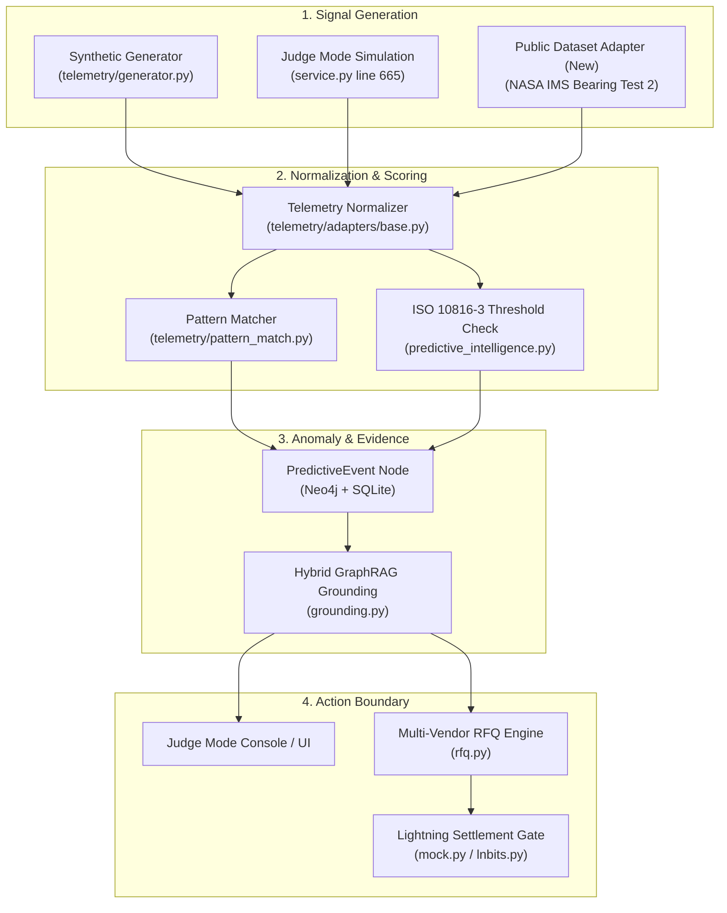

# Telemetry Pipeline Provenance Audit

**Audit Date**: October 2026  
**Audited Subsystems**: `telemetry/`, `backend/app/api/telemetry.py`, `backend/app/services/machine_money/`, `retrieval/`  
**Standard**: Bitshala BOSS Battle 2026 Technical Credibility & Provenance Standard  

---

## 1. Executive Summary

This audit establishes the exact lineage and technical truthfulness of AuRAG's industrial telemetry ingestion, pattern matching, predictive health calculation, and autonomous settlement triggering. 

The audit identifies:
- Where synthetic variables and seeded assets (such as `P-101A` and `VIB-301-BEARING`) originate.
- How thresholds and mathematical anomaly bounds are applied.
- The separation between deterministic demonstration fixtures and live Hybrid GraphRAG retrieval.
- The architectural extension required to support authentic public industrial datasets without breaking canonical demonstration paths.

---

## 2. Ingestion & Provenance Architecture



---

## 3. Component Lineage Breakdown

### 3.1 Where `P-101A` Telemetry is Generated
- **Primary Generator**: [`telemetry/generator.py:generate_reading()`](file:///c:/Users/nisha/OneDrive/Documents/Downloads/AuRAG/telemetry/generator.py#L65-L101).
- **Mechanism**: Reads historical failure signatures `f.signature_json` associated with `(e:Equipment {tag_id: $tag})` from the Neo4j ontology.
- **Baseline Healthy Assumptions**: Stored in Python in `NOMINAL` dict:
  ```python
  NOMINAL = {
      "vibration_mm_s": 2.0,
      "bearing_temp_c": 55.0,
      "discharge_temp_c": 120.0,
      "outlet_temp_deviation_c": 1.0,
      "set_pressure_pct": 100.0,
      "differential_pressure_kpa": 18.0,
      "seal_leak_rate_ml_min": 0.5,
  }
  ```
- **Provenance Classification**: `SYNTHETIC_GENERATOR`. It is an engineered synthetic demonstration fixture simulating sensor drift towards known failure signatures.

### 3.2 Where `VIB-301` Sensor Values are Created
- **Location**: [`backend/app/services/machine_money/service.py:execute_judge_scenario()`](file:///c:/Users/nisha/OneDrive/Documents/Downloads/AuRAG/backend/app/services/machine_money/service.py#L665-L677).
- **Values**:
  - `sensor_id`: `"VIB-301-BEARING"`
  - `vibration_mms`: `5.4` mm/s RMS (radial vibration)
  - `threshold_mms`: `4.5` mm/s (ISO 10816 Zone C boundary)
  - `temperature_c`: `88` °C
  - `event_id`: Generated via `EVT-VIB-{uuid}`
- **Provenance Classification**: Deterministic demonstration event simulating a localized accelerometer excursion on `P-101A`.

### 3.3 Where Thresholds and Standards are Applied
- **Standard**: **ISO 10816-3 Class II Rotating Industrial Pumps** (rigid support, 15 kW to 300 kW).
  - Zone A/B (Satisfactory/Unrestricted): $< 4.5$ mm/s RMS.
  - Zone C (Warning / Long-term damage): $4.5$ to $7.1$ mm/s RMS.
  - Zone D (Critical / Immediate damage): $> 7.1$ mm/s RMS.
- **Code Locations**:
  1. [`telemetry/predictive_intelligence.py:THRESHOLDS`](file:///c:/Users/nisha/OneDrive/Documents/Downloads/AuRAG/telemetry/predictive_intelligence.py#L12-L16):
     ```python
     THRESHOLDS = {
         "vibration_de": {"nominal": 2.5, "warning": 6.5, "critical": 10.0},
         "temperature_de": {"nominal": 65.0, "warning": 85.0, "critical": 105.0},
     }
     ```
  2. [`backend/app/services/machine_money/grounding.py:CANONICAL_VIBRATION_THRESHOLD`](file:///c:/Users/nisha/OneDrive/Documents/Downloads/AuRAG/backend/app/services/machine_money/grounding.py#L19): Fixed at `4.5` mm/s.

### 3.4 Where Anomaly Events are Created
- **Worker Level**: [`telemetry/worker.py:TelemetryWorker.run_cycle()`](file:///c:/Users/nisha/OneDrive/Documents/Downloads/AuRAG/telemetry/worker.py#L53-L91) periodically scans equipment, applies similarity scoring against stored signatures via `match_reading()`, and persists `create_predictive_event()`.
- **API Level**: [`backend/app/api/telemetry.py:scan()`](file:///c:/Users/nisha/OneDrive/Documents/Downloads/AuRAG/backend/app/api/telemetry.py#L49-L88) emits `predictive_event` if similarity exceeds threshold.
- **Machine Money Trigger**: [`backend/app/api/machine_money.py:trigger_from_telemetry()`](file:///c:/Users/nisha/OneDrive/Documents/Downloads/AuRAG/backend/app/api/machine_money.py#L214-L235) bridges the predictive event into autonomous financial settlement.

### 3.5 How Telemetry Reaches Judge Mode
1. Judge Mode UI triggers `POST /api/machine-money/judge/execute`.
2. Controller invokes [`MachineMoneyService.execute_judge_scenario()`](file:///c:/Users/nisha/OneDrive/Documents/Downloads/AuRAG/backend/app/services/machine_money/service.py#L638).
3. Stage 1 executes:
   - Sets `stage = ExecutionStage.ANOMALY_DETECTED`.
   - Records elapsed timing ($< 1$ms).
   - Packages `evidence_refs = [equipment_id, sensor_id, evt_id]`.
4. Stage 2 executes:
   - Calls `get_grounded_evidence_package()`.
   - Matches failure event `FE-001`, work order `WO-1002`, procedure `PROC-001`.
5. Stage 3-7 executes RFQ, Policy check, Lightning payment, and Graph linking.

---

## 4. Truthfulness Audit: Synthetic Fixtures vs. Actual Retrieval

| Pipeline Stage | Implementation | Truthful Label | Provenance Notes |
| :--- | :--- | :--- | :--- |
| **Telemetry Generation** | `telemetry/generator.py` | `SYNTHETIC DEMO` | Generated mathematically from nominal + noise + drift |
| **Telemetry Anomaly (Judge Mode)** | `service.py:execute_judge_scenario` | `SYNTHETIC DEMO` | Hardcoded excursion ($5.4$ mm/s, $88$°C) |
| **Evidence Grounding (Live)** | `retrieval/hybrid.py` | `HYBRID_RETRIEVAL` | True multi-hop retrieval over Neo4j + Vector store |
| **Evidence Grounding (Offline)** | `grounding.py` fallback | `CONTROLLED DEMO FIXTURE` | Explicit offline demonstration fallback |
| **Vendor RFQ** | `rfq.py:CANDIDATE_VENDORS_BY_SERVICE` | `DEMO VENDOR NODE` | In-memory catalog of synthetic candidate bids |
| **Lightning Payment** | `providers/mock.py` | `MOCK / SIMULATION` | Verifiable BOLT11 and sha256 preimage, simulated settlement |

---

## 5. Architectural Gap & Recommendations for Phase 2A

1. **Gap**: Currently, all telemetry input is generated by `telemetry/generator.py` or hardcoded in `execute_judge_scenario()`. There is no mechanism to feed real, published, empirical industrial sensor data through the pipeline.
2. **Solution**:
   - Introduce an extensible adapter interface: `telemetry/adapters/base.py`.
   - Introduce `telemetry/adapters/public_dataset.py` consuming documented open-access run-to-failure vibration data (NASA IMS Bearing Dataset).
   - Retain `telemetry/adapters/synthetic.py` for canonical P-101A testing.
   - Introduce a new Judge Mode preset `PUBLIC DATASET REPLAY` operating on `REPLAY-ASSET-01` without corrupting the canonical `P-101A` demonstration.
   - Maintain clear UI provenance badges distinguishing `[PUBLIC DATASET / REPLAY]`, `[SYNTHETIC DEMO]`, and `[LIVE SCADA]`.
