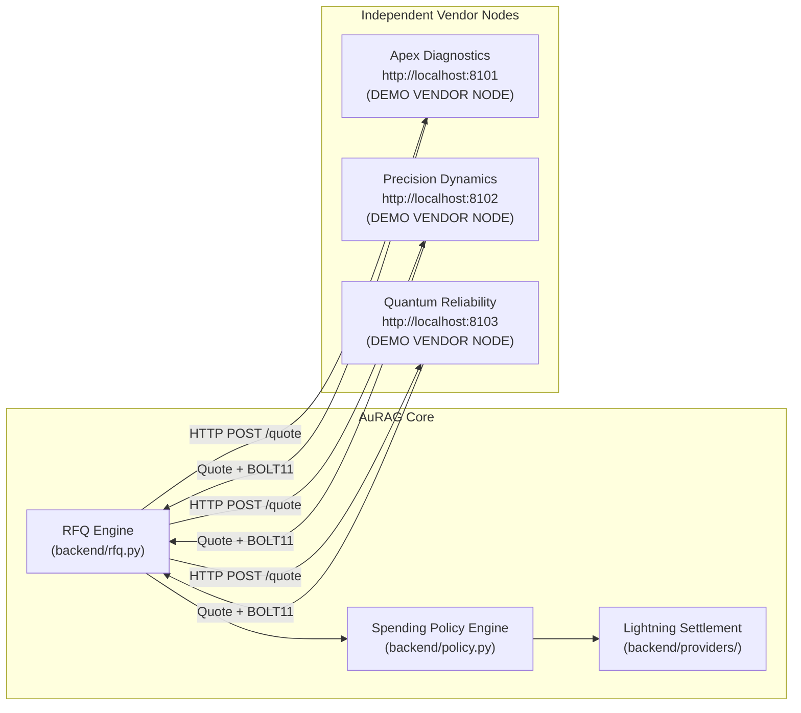

# Vendor Federation & Independent HTTP Webhooks Architecture

**Standard**: Bitshala BOSS Battle 2026 Technical Credibility & Vendor Honesty Guidelines  
**Classification**: `DEMO VENDOR NODE` / `PRE-APPROVED DEMO VENDOR`  
**Prohibition**: Never claim mock/demo vendor services are "real contractors", "live industrial suppliers", or an "external marketplace".  

---

## 1. Architectural Overview

To eliminate the credibility gap of evaluating bids strictly inside an in-memory dictionary, AuRAG decouples vendor bidding into **independently addressable HTTP microservices**.



---

## 2. Independent Vendor Endpoints & Configuration

Each vendor node is implemented as a standalone service with its own cryptographic identity, node public key, pricing schedule, and SLA.

| Vendor Node | Default Port | Environment Variable | Service Focus | Node Pubkey Prefix |
| :--- | :--- | :--- | :--- | :--- |
| **Apex Diagnostics** | `8101` | `VENDOR_APEX_URL` | Precision Laser Alignment & Bearing Inspection | `02a1a1...` |
| **Precision Dynamics** | `8102` | `VENDOR_PRECISION_URL` | Express Ultrasound Analysis (Fastest SLA) | `03b2b2...` |
| **Quantum Reliability** | `8103` | `VENDOR_QUANTUM_URL` | Comprehensive Rotary Overhaul (Maximum Scope) | `02c3c3...` |

### Environment Variables
AuRAG business logic never hardcodes `localhost` URLs. All endpoints are resolved dynamically:
```bash
VENDOR_APEX_URL=http://localhost:8101
VENDOR_PRECISION_URL=http://localhost:8102
VENDOR_QUANTUM_URL=http://localhost:8103
```

---

## 3. Webhook Protocol Specification

Each vendor microservice exposes two standard HTTP endpoints:

### 3.1 `GET /health`
Returns node health and cryptographic identity:
```json
{
  "status": "healthy",
  "vendor_id": "apex-diagnostics",
  "vendor_name": "Apex Diagnostics",
  "node_pubkey": "02a1a1a1...",
  "vendor_node_type": "DEMO VENDOR NODE",
  "disclosure": "PRE-APPROVED DEMO VENDOR: Independent HTTP webhook service for machine-to-machine RFQ demonstration"
}
```

### 3.2 `POST /quote`
Accepts RFQ intent and responds with a verifiable quote and BOLT11 invoice:

**Request Payload**:
```json
{
  "equipment_id": "P-101A",
  "service_id": "bearing-inspection",
  "max_budget_sats": 500,
  "strategy": "FASTEST_SLA"
}
```

**Response Payload**:
```json
{
  "candidate_id": "BID-APEX-A102",
  "vendor_id": "apex-diagnostics",
  "vendor_name": "Apex Diagnostics",
  "node_pubkey": "02a1a1a1...",
  "service_id": "bearing-inspection",
  "service_name": "Precision Bearing Inspection & Laser Alignment",
  "amount_sats": 250,
  "sla_hours": 1.2,
  "reliability_score": 0.994,
  "reputation_tier": "AAA",
  "parts_included": ["Laser Coupling Targets", "Acoustic Sensor Pods", "Mobil SHC 100"],
  "bolt11": "lnbcrt2500n1...",
  "payment_hash": "a1b2c3d4...",
  "vendor_node_type": "DEMO VENDOR NODE",
  "is_synthetic": true,
  "within_policy_cap": true,
  "valid_until": "2026-10-03T03:15:00Z"
}
```

---

## 4. Resilience, Validation & Failure Handling

The AuRAG RFQ engine (`dispatch_http_rfq`) enforces robust production-grade boundaries:
1. **Response Schema Validation**: Checks presence and types of `amount_sats`, `sla_hours`, `reliability_score`, `valid_until`. Malformed responses are dropped.
2. **Quote Expiration Gate**: Bids where `valid_until < now` are immediately rejected.
3. **Timeout & Connection Failure**: If an endpoint times out or returns HTTP 500, the error is logged and the remaining nodes are evaluated.
4. **Zero-Daemon Development Fallback**: In test environments where standalone background daemon processes are not spawned, the engine executes direct in-process ASGI calls via `httpx.ASGITransport(app=vendor_app)`, providing 100% test coverage without port collisions.
5. **Full Offline Fallback**: If all network and ASGI endpoints are unreachable, AuRAG falls back gracefully to its deterministic local catalog with explicit `is_synthetic: true` labeling.

---

## 5. Quote-to-Payment Binding Invariant

Once an RFQ response is selected by the scoring model:
$$\text{vendor\_node} \longrightarrow \text{rfq\_id} \longrightarrow \text{quote\_id} \longrightarrow \text{invoice} \longrightarrow \text{payment\_id}$$

The payment record and audit log capture:
- The winning vendor's identifier and node public key.
- The RFQ selection rationale and strategy.
- The cryptographically valid BOLT11 invoice generated by the vendor node.
- The verified Lightning settlement preimage.
